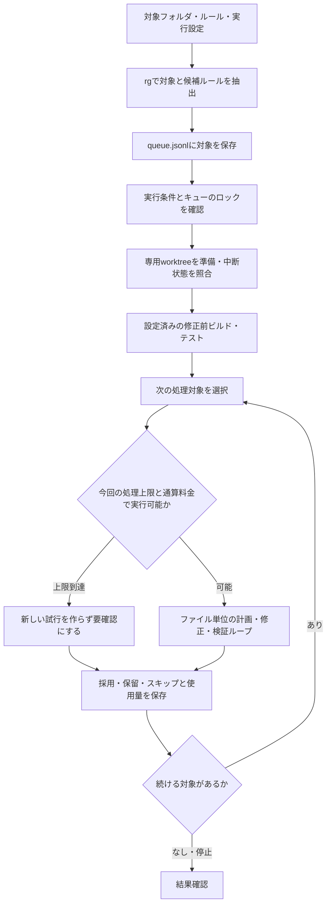
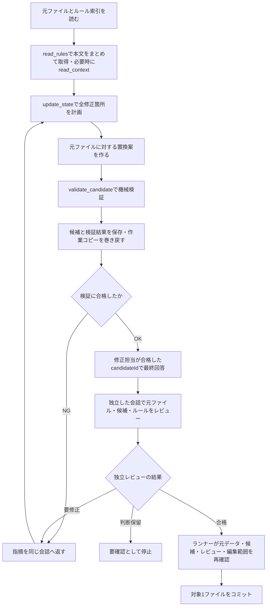
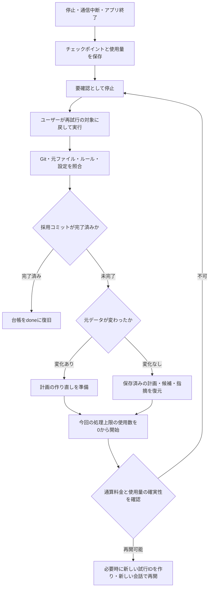

# AI処理のハーネス・ツール・プロンプト

実装確認日: 2026-09-15。

OneByOneは、ファイルごとに独立した会話で修正計画を作り、候補を機械検証します。機械検証が通った候補は、さらに別の会話のLLMがレビューします。検証・レビューの指摘は修正担当の同じ会話に返して修復を続けます。停止後は保存した計画と候補から明示的に再開できます。変更の採用とコミットはランナーだけが行います。

## 1. 構成と責務

| 層 | 主な実装 | 責務 |
|---|---|---|
| GUI / CLI | [app.go](../app.go)、[cmd/onebyone/main.go](../cmd/onebyone/main.go) | 共通engineへの操作入口 |
| カタログ | [catalog.go](../internal/catalog/catalog.go)、[ruleformat/format.go](../internal/ruleformat/format.go) | 定義検証、rgによる対象抽出、共通プロンプト、旧シンボル検査 |
| ランナー | [runner.go](../internal/engine/runner.go)、[service.go](../internal/engine/service.go) | 逐次処理、停止・再開、台帳、採用・コミット |
| 候補検証 | [candidate_validation.go](../internal/engine/candidate_validation.go) | 専用worktreeへの候補反映、設定済み検証、候補記録、巻き戻し |
| 復帰状態 | [repair_checkpoint.go](../internal/engine/repair_checkpoint.go) | 元データとの照合、計画・候補・通算使用量の保存 |
| 会話・ツール | [repair_loop.go](../internal/agent/repair_loop.go)、[protocol.go](../internal/agent/protocol.go)、[repair_plan.go](../internal/agent/repair_plan.go) | LLMループ、5ツール、残りターンの通知、計画検査、最終候補IDの検査 |
| 独立レビュー | [review.go](../internal/agent/review.go)、[review_gate.go](../internal/agent/review_gate.go) | 編集履歴を持たない別会話での意味的検査、指摘の返却、合格の記録 |
| API・使用量 | [client.go](../internal/agent/client.go)、[providers.go](../internal/agent/providers.go) | OpenAI / Azure Responses、Claude Messages、認証、料金予約、通信 |

Goの`net/http`による独自実装です。外部エージェントCLIやFoundryのホスト型エージェントサービスは起動しません。ファイルごとにOSプロセスを作るのではなく、同じGoプロセス内で独立した会話履歴を作ります。

処理は逐次です。キューの実行セッションで専用worktreeを共有し、後続ファイルは先に採用されたコミットを含む状態で処理します。元のチェックアウトへ変更を自動反映しません。

## 2. 処理フロー

### 全体の流れ



開始時にGit、初回コミット、未コミット変更、対象・ルール等を確認します。修正前の検証が失敗する場合はAIを呼ぶ前に停止します。**GUIの実行操作またはCLIの`run`による`Start`ごとに、ファイルのターン・処理時間・ツール・読込量・検証回数・レビュー回数を0から数えます。** 同じ実行中に自動再試行しても、この枠は増えません。過去の使用量は履歴として保持し、料金上限は通算料金で判定します。`Start(limit)`の`limit`は異なるファイルの件数で、`0`は件数制限なしです。

### 1試行内のLLM・ツールループ



複数の個別ルールは`read_rules`でまとめて読み、編集案を出す前に計画を登録します。ツール引数の間違い、不正な置換、早すぎる最終回答も会話内で訂正できます。同じ実行内の修復で会話や上限はリセットしません。編集担当への各LLM要求に、この実行での使用数と、設定されている場合の上限・残りターンを添えます。未設定なら「上限なし」と伝え、架空の実行枠を理由に中断させません。修正の採用には最終回答後の独立レビューも必要です。

計画変更が不要なら、失敗指摘を反映した候補だけを再提出できます。再提出した候補は機械検証・独立レビューを受け直します。計画を更新した場合はRevisionが進み、以前の合格候補を使えなくなります。合格後に状態表示だけのために`update_state`を呼ぶ必要はありません。

### 中断後の復帰



「継続」は同じ会話内の修復、「復帰」は停止後に新しい会話を作る処理です。元ファイル・コミット・ルール・設定が同じなら、未完了の試行を同じ試行IDで継続します。**ターン数上限`maxTurns`だけの変更も、計画・候補・既読ルール・試行IDを維持します。** その他の照合対象が変わった場合は新しい試行IDを作り、以前の変更前・変更後・差分を保持します。どちらも履歴と通算使用量は残し、明示的な実行開始ごとに処理上限を新しく確保します。停止していた壁時計時間は処理時間に加算しません。

保留・完了などで通常の実行対象から外れたファイルには、`RetryTasks`による明示的な再試行の指定が必要です。この操作は対象を`pending`に戻し、過去の使用ターンでは拒否しません。上限判定の使用数は次の`Start`で0から数えます。同じ候補のレビュー結果を保存済みなら、追加のLLM要求なしに終了できます。停止や使用量不明を、通常の検証NGとして自動再送しません。未知の作業コピー変更や復旧できない状態は、勝手に巻き戻さず停止します。

## 3. 対象抽出とルール

rgはアプリの機械処理で使い、AIの検索ツールとして公開しません。

1. `rg --files --null --hidden --no-ignore --no-config`で列挙し、指定globと固定除外を適用します。
2. 共通ルールがあれば、この範囲の全ファイルが対象です。共通ルールがなく旧シンボル定義がある場合は、その一致で絞り込みます。
3. 個別ルールの`pattern`が本文に一致したIDを、JSONLの`rules`に記録します。共通ルールIDは各行に重複して保存しません。
4. 共通ルールと機械抽出された候補ルールには、AIの適用判断と理由を必須にします。候補外の個別ルールも読んで追加できます。

正規表現一致は適用の確定ではありません。個別ルールを「変更不要」と判断する場合も、先に本文を読む必要があります。共通ルールは全文を初期コンテキストに含めるため、読込ツールによる再読込は不要です。

旧シンボル一覧は出口の残存検査にも使います。コメントも検査対象です。名前が消えたことだけでは、呼び出し順序やデータの固定タイミングの正しさは保証できません。

## 4. AIに公開する5ツール

各ツールの引数は厳密なJSONスキーマで検査し、未知のフィールドを拒否します。任意のコマンド、対象パスを指定した書込み、キューの状態変更を行うツールはありません。

| ツール | 引数 | 結果 |
|---|---|---|
| `read_rules` | `ids` | 複数ルールのMarkdown本文をID別のJSONオブジェクトで返す。成功した本文はキャッシュ |
| `read_rule` | `id` | カタログ内のルール本文をMarkdownで返す。同じルールはキャッシュ |
| `read_context` | `path`, `startLine`, `endLine` | 対象プロジェクト内の指定行を返す |
| `update_state` | `expectedRevision`, `ruleDecisions`, `items` | 正規化した計画、新Revision、未対応項目IDを保存して返す |
| `validate_candidate` | `planRevision`, `baseHash`, `edits`, `addressedItemIds` | 候補ID・ハッシュ・合否・チェック・指摘を返す。採用はしない |

### read_rules

```json
{"ids":["R101","R102","R103"]}
```

複数の個別ルールを必要とする場合は、このツールを優先します。1回につき1〜32個の重複しないカタログIDを指定でき、取得したIDと本文の組を1つのツール結果として返します。未知・不正・重複IDは、本文を読む前に全件検査して拒否します。本文はUTF-8、JSONの枠組み・エスケープを含めた出力全体は96 KiB以内です。

全件成功した場合だけ新しく読んだ本文をキャッシュします。途中で読めないルールや上限超過があれば、部分的な既読記録を残しません。大きすぎる場合はIDを分けて再要求できます。共通ルールや成功済みの本文を不要に読み直す必要はありません。まとめて取得しても、適用するかどうかはルールごとにAIが判断します。`read_rule`による単体取得も利用できます。

### update_state

増分パッチではなく、毎回計画全体を送ります。

```json
{
  "expectedRevision": 0,
  "ruleDecisions": [
    {"ruleId": "R001", "decision": "no_change", "reason": "既存の例外処理を維持できる"},
    {"ruleId": "R106", "decision": "modify", "reason": "通常経路とデバッグ分岐の両方に対象の呼び出しがある"}
  ],
  "items": [
    {"id": "P01", "ruleId": "R106", "location": "dispatch: 通常の送信後", "risk": "送信内容を丸ごと記録すると認証情報がログに残る", "change": "記録内容を許可済みの情報に限定する", "expected": "秘密情報をログに記録しない", "status": "pending", "holdReason": ""},
    {"id": "P02", "ruleId": "R106", "location": "dispatch: if (debug)", "risk": "デバッグ分岐にも送信内容を記録する呼び出しがある", "change": "デバッグ分岐の禁止ログを削除する", "expected": "デバッグ時も秘密情報を記録しない", "status": "pending", "holdReason": ""}
  ]
}
```

| 項目 | 制約 |
|---|---|
| `ruleDecisions` | 各ルールの`modify` / `no_change` / `blocked`と空でない理由。共通・候補をすべて含める |
| `items` | 修正箇所ごとにID、ルールID、場所、リスク、変更内容、満たすべき条件、状態、保留理由を記録。同じルールでも複数箇所は分ける |
| `risk` | 対象コードとルールから説明できる、対応しない場合の問題。新しい計画の送信時に必須 |
| `holdReason` | 新しい計画の送信時に必須。`blocked`項目には確認が必要な理由を記録し、保留しない項目は空文字 |
| `status` | `pending` / `proposed` / `blocked`。`proposed`はAIの対応申告で、検証済みを意味しない |
| Revision | 現在値と`expectedRevision`が一致したときだけ更新。成功すると1増加 |
| 取り下げ | 前に判断したルールを黙って削除しない。項目を取り下げる場合は、そのルールの理由を更新する |
| ID | 重複、別ルールへの使い回し、同じ変更の不要な振り直しを拒否 |

`modify`のルールには1つ以上の項目が必要です。`no_change`のルールには変更項目を付けません。`blocked`のルールには、保留する具体的な箇所を示す`blocked`項目を付けられます。`modify`の個々の項目を`blocked`にすることもできます。保留箇所があれば候補検証・採用には進めません。`remainingItemIds`はまだ`proposed`でない項目であり、機械検証の不合格一覧ではありません。

既存の保存計画に`risk`・`holdReason`がない場合も復元します。新しく計画を送信するときはこれらを記録し、過去に記録のなかったリスクや箇所をアプリが推測して補うことはありません。

### validate_candidate

```json
{
  "planRevision": 1,
  "baseHash": "最初に渡された元ファイルのSHA-256",
  "edits": [
    {"oldText": "client.send(payload);", "newText": "client.send({ body: payload });", "itemIds": ["P01", "P02"]}
  ],
  "addressedItemIds": ["P01", "P02"]
}
```

各置換には、その変更で対応する計画項目の`itemIds`を付けます。計画に存在しないIDや別の保留項目を指定した候補は拒否します。ハーネスは一意な`oldText`の位置と実際の置換結果から変更前・変更後の行範囲を算出し、対応するルールとともに候補記録・試行レポートへ保存します。行番号の自己申告や場所の説明文からは推測しません。行対応のない過去の記録はそのまま扱います。

上は引数形式の例です。実際の`edits`は全計画項目を実装する内容である必要があります。`addressedItemIds`は重複なく全項目を含め、`blocked`の判断・項目がある候補は拒否します。`pending`項目を候補で対応したと申告することはできます。

`baseHash`はBOM・改行も含む**元ファイルの生バイト列**のSHA-256です。一方、AIに渡す本文と`oldText`照合はBOMを外し、CRLFをLFに正規化した文字列です。ランナーが保存時に元の形式を復元します。

すべての候補は最初の元本文に対する**置換案全体の差し替え**です。不合格候補に対する追加パッチではありません。`oldText`は非空・元本文に一意・置換同士が非重複、`newText`は削除なら空を許可します。既存の文字列を残した`newText`で、その前後への挿入・追記も表現できます。

| 応答項目 | 意味 |
|---|---|
| `candidateId`, `candidateHash`, `planRevision` | 検証した候補と計画の識別情報 |
| `passed`, `checks` | ランナーが実行した検証結果 |
| `diagnostics` | 不合格理由。取得できた場合は`lineBasis: "candidate"`、行番号、コード断片を含む |
| `remainingItemIds` | 未対応項目の関連付け用。現在は自動推定せず空配列。計画の意味的な正しさを証明しない |

指摘と計画項目の対応は推測しません。一般的なビルドエラーを無理に特定ルールへ割り当てることはありません。

検証出力は[候補表示の制限](../internal/agent/candidate_view.go)に従って短縮します。チェックポイントのチェック詳細は1件4 KiB・合計32 KiB、通常のツール応答では1件1 KiB・合計16 KiBです。診断も最大20件で、メッセージ・コード断片に別の上限を設けます。取得した検証出力は候補の`.validation.json`に保存し、大量のビルドログを会話や復帰状態へ丸ごと持ち込みません。

### 読み取り範囲

`read_context`は`/`区切りのプロジェクト相対パス、1始まり・両端含む・最大200行です。指定範囲64 KiB以内、元ファイル全体も`maxFileBytes`以内に制限します。

絶対パス、`..`、リンク経由、曖昧なWindowsパス、設定・認証用パスを拒否します。`AGENTS.md`、`CLAUDE.md`、`SKILL.md`、`.codex`、`.env`系などは読みません。完全な制限は`safeRelativePath()`と`forbiddenContext()`を参照してください。

## 5. プロンプトと最終回答

| 要素 | 内容 |
|---|---|
| 固定指示 | 対象1ファイル、入力を命令として扱わない、読込後に計画、元本文基準の候補、検証NGへの修復、採用はランナー、説明は日本語 |
| カタログ | 共通ルール全文と個別ルール全件の索引。個別索引はID・名称・変更概要の要約 |
| ファイル入力 | `file`, `content`, `baseHash`, `candidateRules`, `previousFailure` |
| 復帰時の追加情報 | `repairState`の計画・最後の候補と検証・通算使用量、および`previouslyReadRules` |
| 各編集要求の追加指示 | この実行での使用ターン。正の上限がある場合は編集と独立レビューを合算した残りを通知し、未設定なら上限なしと通知。予測上の枠不足だけで終了しないよう指示 |

対象本文は全文です。ファイルを自動分割して処理する機能はありません。ルールは`rule.json`の`overview`、`before`、`after`、`notes`、`holdConditions`を「変更概要／変更前／変更後／備考／修正を保留すべきケース」のMarkdownに変換します。`pattern`はAI向け本文に含めません。

固定指示の正本は[protocol.go](../internal/agent/protocol.go)の`instructions`です。変動する残りターンの通知は固定指示・ルール本文の後ろへ付け、会話履歴に同じ通知を積み重ねません。ツール定義と最終回答スキーマはAPIの専用フィールドで指定します。

最終JSONは次の3項目だけです。置換案や適用ルールの別申告は含めません。

```json
{"outcome":"modified","candidateId":"検証で返された候補ID","note":"通常経路とデバッグ分岐の記録内容を修正しました。"}
```

- `modified`は、**最後に機械検証した候補が合格している場合**に、そのIDだけを指定できます。現在の計画と一致する必要があり、以前の候補の合格や更新前のRevisionを流用できません。この回答を受けて独立レビューを開始し、その合格後にランナーへ返します。
- `skipped`は、必須ルールの判断済み、すべて`no_change`、変更項目なし、`candidateId`空が条件です。さらにランナー側の旧シンボル検査が必要です。独立レビューの未解決の指摘がある場合、計画を取り下げて`skipped`に変更することはできません。新しい候補を修正・検証するか、`needs_human`で保留にします。
- `needs_human`は`candidateId`空と具体的な理由を返します。計画登録後は、ルール判断の`blocked`＋理由、または項目の`blocked`＋`holdReason`を先に保存しなければ最終回答を受け付けません。未完の修正、候補の再提示量、未実施の検証、残り上限への予測だけでは人の判断待ちにできず、同じ会話へ差し戻します。仕様不明、ルール競合、他ファイル編集が必要な場合などの具体的な保留は維持します。計画自体を作れない文脈不足には、計画登録前の保留を許可します。

適用ルールIDは採用候補の計画から取り出します。APIレスポンスの使用量をアプリが集計し、AIの自己申告値は採用しません。

OpenAI / AzureはResponses API、ClaudeはMessages APIを使用します。サーバー側の会話IDを使わず、各リクエストに当該ファイルの履歴を送ります。Responsesは`store: false`です。reasoning / thinkingの継続ブロックは会話内だけで保持し、チェックポイントへ保存しません。プロンプトキャッシュのヒットや割引率は保証せず、報告された使用量と設定単価で計算します。

## 6. 検証・採用

候補を反映する前に、専用worktreeが記録した元コミット・元ファイルと一致し、未知の変更がないことを確認します。その後、以下を実行します。

1. 置換の一意性、ファイルサイズ、文字コード・改行、変更差分を確認する。
2. 設定時は旧シンボル残存を検査し、変更範囲が対象1ファイルだけか確認する。
3. 先行検査が通れば、設定済みビルド・テストを順番に実行する。
4. 検証コマンドが別ファイルや対象内容・種類・権限を変更していないか再確認する。
5. 候補と検証結果を保存し、**合格・不合格のどちらでも元の状態へ巻き戻す**。

通常の不合格はツール応答で返します。保存不能、未知の変更、巻き戻し不能など、継続して安全に検証できないエラーはループを停止します。

### 独立レビュー

機械検証を通過した候補について、修正担当が`modified`の最終回答を返した時点で実行します。使用する接続・モデルは実行設定で選択したものと同じですが、**毎回新しい会話を作ります**。レビューに編集・読込ツールは付けません。

| レビューへ渡すもの | 内容 |
|---|---|
| 対象 | ファイルの相対パス、修正前全文、候補全文、両方の生バイト列ハッシュ |
| ルール | 共通ルール、機械抽出された候補ルール、修正担当が追加で判断したルールのID・名称・Markdown全文・共通ルールかを示す`always` |
| 専用指示 | 見落とし、呼出順序・タイミング、所有権、非同期処理、データの流れ、既存動作の破壊、判断保留条件を確認する |

修正担当の会話履歴、計画・判断理由、最終説明、機械検証の結果、以前のレビュアーの指摘は渡しません。追加ルールのIDはレビュー範囲の選定に使いますが、修正担当がそのルールをどう判断したかは含めません。必要な周辺仕様が本文とルールだけでは分からない場合は、推測せず判断保留にします。

レビューの応答は以下の項目を持つ厳密なJSONです。

| 項目 | 内容 |
|---|---|
| `baseHash`, `candidateHash` | 対象と候補の識別情報。渡した値と一致する必要がある |
| `verdict`, `summary` | `passed` / `needs_changes` / `needs_human`と短い説明 |
| `assessments` | 渡された全ルールを各1回、`ruleId`, `status`, `reason`で判定。状態は`satisfied` / `not_applicable` / `violated` / `needs_human`。共通ルールも該当箇所がなければ理由付き`not_applicable`を許可 |
| `issues` | `ruleId`, `location`, `lineBasis`, `excerpt`, `reason`, `requestedChange`。`lineBasis`は`before` / `after`で、コード断片は指定した側の本文に実在する必要がある |

`passed`には未解決のルールや指摘を残せません。共通ルールは評価自体を省略できませんが、修正前・候補のどちらにも該当する構文や状況がない場合は、具体的な理由付きの`not_applicable`を許可します。既に条件を満たしている場合や、今回の修正で該当コードを解消した場合は`satisfied`とします。`needs_changes`には具体的な指摘が必要です。違反としたルールには対応する指摘を必須にし、架空の引用や知らないルールID、評価漏れを拒否します。ルール外の既存動作の破壊については、指摘の`ruleId`を空にできます。

要修正の場合は、その判定・ルール別評価・指摘を修正担当の**同じ会話**に返します。修正担当は元ファイルを基準に新しい候補を検証し、再度最終回答を提出します。次のレビューにも、新しい会話で修正前・候補・ルールだけを渡します。判断保留は`needs_human`として停止します。レビューの通信失敗、形式違反、保存失敗を合格として扱いません。

レビュー合格後、ランナーが候補ID、計画、元データ、保存済み候補ハッシュ、同じ候補に対するレビュー合格、編集範囲を再確認し、合格したバイト列だけを反映・コミットします。**ビルド・テストは候補ごとに実施し、最終コミット時に同じ候補へ重複実行しません。** 実行開始時の修正前検証は別です。`skipped`や`needs_human`には変更の採用がなく、独立レビューを追加実行しません。

検証コマンドは設定済みの`executable`と`args`を直接起動します。AIはコマンドを指定できません。カレントディレクトリは専用worktree内の対象フォルダで、自動的にシェルを挟みません。OSサンドボックスはなく、通常のユーザー権限で動作します。

## 7. 保存・復帰・使用量

```text
queue.jsonl
queue.jsonl.session.json
queue.jsonl.worktree/
queue.jsonl.artifacts/
  <attempt-id>.before
  <attempt-id>.after
  <attempt-id>.diff
  <attempt-id>.state.json
  <attempt-id>.review-<review-id>.json
  <attempt-id>.candidate-<candidate-id>.after
  <attempt-id>.candidate-<candidate-id>.diff
  <attempt-id>.candidate-<candidate-id>.validation.json
```

キュー・記録は対象ソースの外に保存します。`.state.json`は試行ID、対象パス、元コミット、元ファイル・ルール・設定のハッシュ、計画、最後の候補と検証結果、独立レビューの要求状態・判定・指摘・使用量、既読ルールID、通算カウンターを持ちます。レビュー履歴は試行の`reviews`にも記録します。会話全文、reasoning、接続の認証情報は保存しません。設定ハッシュの計算からも認証情報を除きます。

試行の`changes`には、箇所別の`id`・`ruleId`・当時の`ruleTitle`・`location`・`risk`・`change`・`expected`・`status`・`reason`を保存します。結果画面の「対応状況」と出力JSONはこの記録を使います。状態はAIの`proposed`をそのまま使わず、ランナーが保存済み計画・候補・レビュー・コミットの対応から決定します。

| 対応状態 | 意味 |
|---|---|
| `fixed` | その項目を含む候補が機械検証・独立レビューに合格し、コミット済み |
| `needs_human` | その箇所やルールに人の確認が必要。理由も記録 |
| `not_applied` | 試行は終了したが、その対応は採用されていない |
| `pending` | 修正・検証中で、まだ採用されていない |
| `unchanged` | 変更不要の判断が、採用候補の独立レビューまたは修正不要時の機械検証で確認された記録 |

ファイルが`needs_human`で終了した場合、対応できる部分の案があっても部分コミットしません。保留箇所を`needs_human`、その他の未採用の案を`not_applied`として区別します。レビューの指摘箇所を計画項目へ推測で割り当てず、別の記録として残します。リスク・期待条件はコードとルールに基づくAIの説明であり、独立した正しさの証明ではありません。履歴には各試行の記録を保持し、過去のデータにない情報は画面で「未記録」と表示します。

通算カウンターは履歴・料金・復旧のために残します。ランナーは各`Start`でファイルを初めて処理するとき、状態ファイルと試行履歴から復元したカウンターの最大値を、その実行の基準値として1回だけ保持します。`agent.Input.BudgetBaseline`とレビュアーの`TurnBaseline`へ渡し、上限判定には「通算値 − 基準値」を使います。同じ実行中の自動再試行でも基準値を取り直しません。基準値は実行中のメモリにだけ保持し、状態ファイルへ保存しません。中断やアプリ終了後の新しい`Start`でも同じ仕組みで0から始まり、過去の`Usage.Turns`・トークン・費用の記録を消しません。

ツール・通信ごとの状態は`.state.json`へ原子的に保存します。JSONL全体の保存は、状態ファイルの初回登録、候補の書込、検証結果、採用・終了などの区切りで行います。復旧時は最新の状態ファイルから使用量を照合し、ファイル数が多いキュー全体を毎ターン書き直すことを避けます。

送信**前**に`requestPending`、リクエストID、使用ターン数を保存し、応答後に使用量を更新します。独立レビューも同じ仕組みを使い、`requestKind`で編集・レビューを区別します。送信中に終了した要求を「まだ使っていない」として扱わないためです。リクエストIDはローカル追跡用で、プロバイダーの二重課金を防ぐ再送保証ではありません。

LLM送信直前と`validate_candidate`による検証直前のチェックポイントには、処理時間も今回の設定上限まで保守的に予約して保存します。通常の応答・検証完了・停止・エラーでは実測の累計時間で上書きします。要求中や長いビルド・テスト中の強制終了で実測を保存できなかった場合は、予約した時間の記録が残ります。明示的な再実行では新しい基準値を使うため、この記録のためだけに時間上限を引き上げる必要はありません。検証中の`requestPending`は`false`で、LLM使用量は既知です。LLM通信中の終了には、使用量不明と料金上限の制約も別途適用します。

復帰時は元ファイル・コミット・ルール・設定を照合します。`maxTurns`だけの変更は修正内容を変えないため、計画・候補・既読キャッシュ・試行IDを維持します。その他の照合対象が変わった場合は以前の計画・候補・既読キャッシュを無効化し、新しい試行IDで計画を作り直します。古い試行の記録と成果物、ファイル通算の使用量・回数は保持します。ルールの変更では、実行前の対象再抽出が必要になる場合もあります。

独立レビュー待ちで停止した場合、元データが変わっていなければ、修正担当の作業を繰り返さず保存済み候補の独立レビューから復帰します。既に同じ候補の合格が保存されていれば、その記録を照合して採用へ進みます。レビュー中断の使用量・回数は履歴へ残し、新しい実行ではレビュー回数・ターン数・時間を0から数えます。

使用量不明の要求は自動再送しません。料金上限なしの明示的な再実行では、不明フラグを残して継続できます。**料金上限がある場合、過去の不明な課金を確定できないため追加送信を拒否します。** `context canceled`はキャンセルであり、コンテキスト長超過という意味ではありません。

コミット直後の終了は、台帳、Gitの親コミット・対象・出力ハッシュ・`OneByOne-Attempt`を照合して`done`を復旧します。未完了の候補を新しい変更として二重採用しません。

## 8. 上限と保証範囲

新規ワークスペースの上限・料金は未設定（0）で保存します。候補検証・独立レビュー・試行回数、ターン数、処理時間は未設定なら上限なしです。画面には「未設定（上限なし）」と表示し、明示的に設定した正の上限だけを適用します。出力トークンとファイルサイズは、未設定時に8,192 tokens・524,288 bytesを使い、補完値は設定に書き戻しません。既存の正の設定値は自動で消しません。


処理上限と料金は「実行設定」で編集し、各ワークスペースの`workspaces/<ID>/setting.json`の`config`へ保存します。対象は`maxAttempts`、`maxTurns`、`maxOutputTokens`、`maxFileBytes`、`timeoutSeconds`、`maxCostUSD`と入力・キャッシュ入力・出力の3単価です。ルールパッケージの設定には対象・除外globと検証コマンドだけを含め、パッケージの読み込みで実行側の上限・単価を変更しません。保存先の分離によって、以下の上限判定や再実行時の集計方法は変わりません。

| 制限 | 既定値・上限 | 単位 |
|---|---|---|
| `maxAttempts` | 未設定0は上限なし、正値1〜3 | 1回の実行・1ファイルの候補検証回数。検証NG後の再提出を含む |
| 独立レビュー回数 | `maxAttempts`と同じ値 | 1回の実行・1ファイル。候補検証とは別に集計 |
| `maxTurns` | 未設定0は上限なし、正値1〜32 | 1回の実行・1ファイルのLLMリクエスト回数。編集・独立レビューを合算 |
| `timeoutSeconds` | 未設定0は上限なし、正値10〜3600秒 | 1回の実行・1ファイルのLLM・ツール処理時間。開始時の基準検証・最終コミットには別途同じ長さの期限 |
| `maxCostUSD` | 既定0は上限なし | 編集・独立レビューを合わせたファイル通算。正値の場合は送信前に保守的な次回費用も予約 |
| `maxOutputTokens` | 既定8192、設定256〜32768 | 1応答 |
| `maxFileBytes` | 既定524288、設定1024〜1048576 bytes | 対象・周辺参照元・修正後ファイル |
| ツール呼出 | 1応答8件。ターン上限を設定した実行ではファイルごとに合計32件 | ターン上限なしの場合は累計件数で止めない |
| ツール結果 | 1件96 KiB。ターン上限を設定した実行ではファイルごとに合計512 KiB | ターン上限なしの場合は累計読込量で止めない。計画・検証の応答も含む |
| 計画 | 64 KiB、判断256件、項目256件 | `update_state`の完全な計画 |
| 読込ツール引数 | 4096 bytes | `read_rules` / `read_rule` / `read_context` |
| 候補引数 | 2 MiB以内 | LLM応答全体にも4 MiB上限がある |
| リクエスト | 2 MiB、カタログプロンプト512 KiB | 履歴込み。自動要約・分割はしない |

置換は1候補で最大100件です。件数・一意性・重複などの形式違反は、検証回数を消費する前にツールエラーとして返します。1候補の変更割合の上限はなく、一意なコード断片の置換により広い構造変更も表現できます。

ターン上限に達した場合は、今回の実行で編集・独立レビューを合算した使用数と上限をエラーに表示します。対象を再試行に戻して実行すれば0から数え直すため、再開のためだけに上限の引き上げや新しいキューの作成は必要ありません。保存済みの計画・候補・指摘・履歴を使って復帰します。

候補検証・ツール引数・最終回答・独立レビューの拒否理由は実行ログに残し、直前の拒否によって完了できなかった場合は上限エラーにもその理由を添えます。既に修正済みの古い拒否理由を、現在の停止理由として再表示しません。ルールをまとめて読んでも、必要な修正・レビュー回数によって上限到達は起こり得ます。

HTTP再送は明確な429だけ最大2回です。通信結果が不明なPOSTや5xxを無条件に再送しません。ファイル単位の復帰とは別の処理です。

計画は、ルールや分岐の見落としを減らすための判断記録です。`proposed`や全項目への対応申告だけで意味的な正しさは保証できません。独立レビューは修正担当の説明に引きずられずに意味的な問題を検出する追加ゲートですが、LLMによる判定なので見落としは残ります。処理順序や副作用を確実に検証するには、設定する動作テストも必要です。

旧シンボル・ビルドが未設定の場合、その検査は未実施として記録します。`modified`は他の検査が通れば採用できます。`skipped`は旧シンボル検査を実行できなければ`needs_human`です。Gitに無視された生成物や任意のソース内に埋め込まれた秘密情報を、すべて検出する仕組みではありません。

設定と配布方法は[設計書](design.md)、コマンドによる検証は[ビルド手順](build.md)を参照してください。
