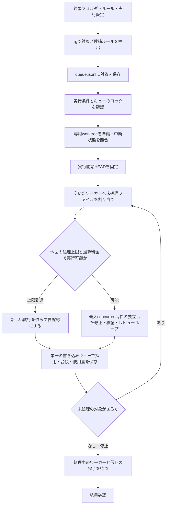
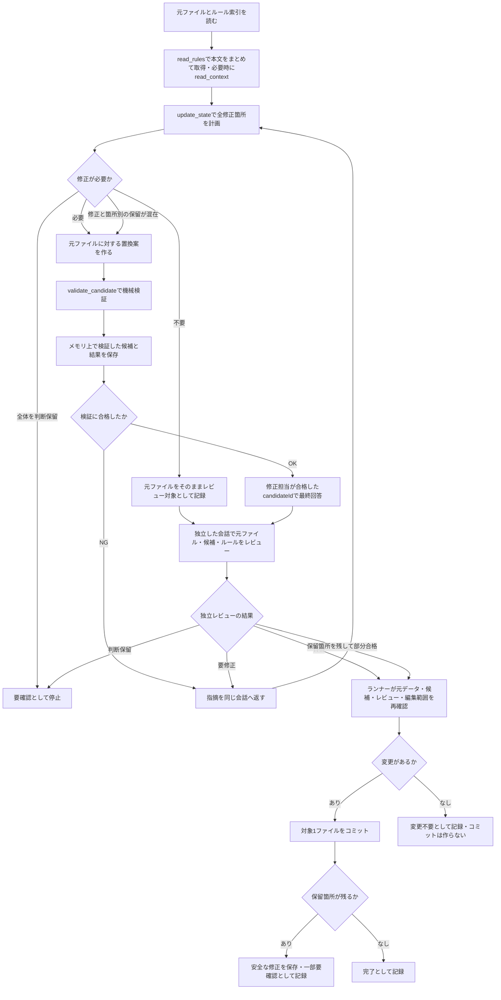
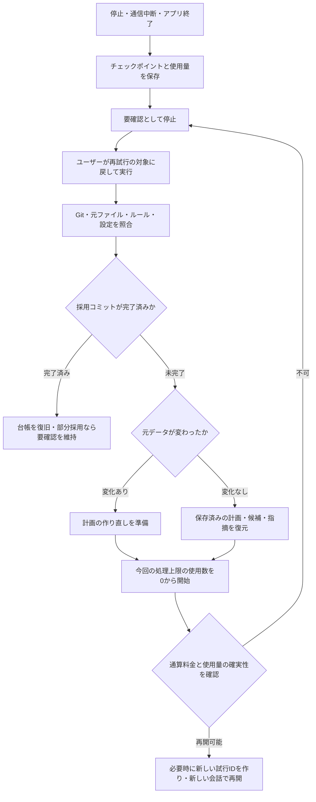

# AI処理のハーネス・ツール・プロンプト

実装確認日: 2026-09-28。

OneByOneは、ファイルごとに独立した会話で修正計画を作り、候補を機械検証します。機械検証が通った候補と、変更不要という判断は、さらに別の会話のLLMがレビューします。検証・レビューの指摘は修正担当の同じ会話に返して修復を続けます。停止後は保存した計画と候補から明示的に再開できます。変更の採用とコミットはランナーだけが行います。

## 1. 構成と責務

| 層 | 主な実装 | 責務 |
|---|---|---|
| GUI / CLI | [app.go](../app.go)、[cmd/onebyone/main.go](../cmd/onebyone/main.go) | 共通engineへの操作入口 |
| カタログ | [catalog.go](../internal/catalog/catalog.go)、[ruleformat/format.go](../internal/ruleformat/format.go) | Markdown定義検証、globとrgによる対象抽出、ファイル別のルール範囲とプロンプト |
| ランナー | [runner.go](../internal/engine/runner.go)、[service.go](../internal/engine/service.go) | ファイル単位の並列処理、停止・再開、台帳、採用・コミットの直列化 |
| 候補検証 | [candidate_validation.go](../internal/engine/candidate_validation.go) | メモリ上での編集整合性検証、候補・差分・検証結果の保存 |
| 復帰状態 | [repair_checkpoint.go](../internal/engine/repair_checkpoint.go) | 元データとの照合、計画・候補・通算使用量の保存 |
| 会話・ツール | [repair_loop.go](../internal/agent/repair_loop.go)、[protocol.go](../internal/agent/protocol.go)、[repair_plan.go](../internal/agent/repair_plan.go) | LLMループ、5ツール、残りターンの通知、計画検査、最終候補IDの検査 |
| 独立レビュー | [review.go](../internal/agent/review.go)、[review_gate.go](../internal/agent/review_gate.go) | 編集履歴を持たない別会話での意味的検査、指摘の返却、合格の記録 |
| API・使用量 | [client.go](../internal/agent/client.go)、[providers.go](../internal/agent/providers.go) | OpenAI / Azure Responses、Claude Messages、認証、料金予約、通信 |

Goの`net/http`による独自実装です。外部エージェントCLIやFoundryのホスト型エージェントサービスは起動しません。ファイルごとにOSプロセスを作るのではなく、同じGoプロセス内で独立した会話履歴を作ります。

ファイルの修正・機械検証・独立レビューを並列で進めます。並列数は`concurrency`で1〜10、未指定の`0`は2です。同じファイルを複数のワーカーへ割り当てず、各ワーカーの会話・計画・使用量・候補を分離します。1に設定すると逐次処理になります。

対象本文と`read_context`の周辺コードは、**実行開始時の同じGitコミット**を参照します。途中で別ファイルが採用されても、その実行の入力は変わりません。候補検証は作業コピーを書き換えず、合格した候補だけを専用worktreeに反映します。採用・Git操作・台帳更新は1つの書き込みキューに集約し、完了順に処理します。元のチェックアウトへ変更を自動反映しません。

## 2. 処理フロー

### 全体の流れ


```mermaid
flowchart TD
    Config["対象フォルダ・ルール・実行設定"] --> Scan["rgで対象と候補ルールを抽出"]
    Scan --> Queue["queue.jsonlに対象を保存"]
    Queue --> Start["実行条件とキューのロックを確認"]
    Start --> Worktree["専用worktreeを準備・中断状態を照合"]
    Worktree --> Baseline["実行開始HEADを固定"]
    Baseline --> Pick["空いたワーカーへ未処理ファイルを割り当て"]
    Pick --> Budget{"今回の処理上限と通算料金で実行可能か"}
    Budget -->|"可能"| Session["最大concurrency件の独立した修正・検証・レビューループ"]
    Budget -->|"上限到達"| Hold["新しい試行を作らず要確認にする"]
    Hold --> Writer
    Session --> Writer["単一の書き込みキューで採用・台帳・使用量を保存"]
    Writer --> More{"未処理の対象があるか"}
    More -->|"あり"| Pick
    More -->|"なし・停止"| Drain["処理中のワーカーと保存の完了を待つ"]
    Drain --> Result["結果確認"]
```

開始時にGit、初回コミット、未コミット変更、対象・ルール等を確認します。Gitや対象設定に不備がある場合はAIを呼ぶ前に停止します。**GUIの実行操作またはCLIの`run`による`Start`ごとに、ファイルのターン・処理時間・ツール・読込量・検証回数・レビュー回数を0から数えます。** 同じ実行中に自動再試行しても、この枠は増えません。過去の使用量は履歴として保持し、料金上限は通算料金で判定します。`Start(limit)`の`limit`は異なるファイルの件数で、`0`は件数制限なしです。

### 1試行内のLLM・ツールループ


```mermaid
flowchart TD
    Input["元ファイルとルール索引を読む"] --> Read["read_rulesで本文をまとめて取得・必要時にread_context"]
    Read --> Plan["update_stateで全修正箇所を計画"]
    Plan --> Need{"修正が必要か"}
    Need -->|"必要"| Candidate["元ファイルに対する置換案を作る"]
    Need -->|"不要"| Unchanged["元ファイルをそのままレビュー対象として記録"]
    Need -->|"全体を判断保留"| Hold
    Need -->|"修正と箇所別の保留が混在"| Candidate
    Unchanged --> Review
    Candidate --> Validate["validate_candidateで機械検証"]
    Validate --> Restore["メモリ上で検証した候補と結果を保存"]
    Restore --> Pass{"検証に合格したか"}
    Pass -->|"NG"| Feedback["指摘を同じ会話へ返す"]
    Feedback --> Plan
    Pass -->|"OK"| Final["修正担当が合格したcandidateIdで最終回答"]
    Final --> Review["独立した会話で元ファイル・候補・ルールをレビュー"]
    Review --> Verdict{"独立レビューの結果"}
    Verdict -->|"要修正"| Feedback
    Verdict -->|"判断保留"| Hold["要確認として停止"]
    Verdict -->|"合格"| Adopt["ランナーが元データ・候補・レビュー・編集範囲を再確認"]
    Verdict -->|"保留箇所を残して部分合格"| Adopt
    Adopt --> Changed{"変更があるか"}
    Changed -->|"あり"| Commit["対象1ファイルをコミット"]
    Commit --> Status{"保留箇所が残るか"}
    Status -->|"あり"| Partial["安全な修正を保存・一部要確認として記録"]
    Status -->|"なし"| Done["完了として記録"]
    Changed -->|"なし"| Skip["変更不要として記録・コミットは作らない"]
```

複数の個別ルールは`read_rules`でまとめて読み、編集案を出す前に計画を登録します。ツール引数の間違い、不正な置換、早すぎる最終回答も会話内で訂正できます。同じ実行内の修復で会話や上限はリセットしません。編集担当への各LLM要求に、この実行での使用数と、設定されている場合の上限・残りターンを添えます。未設定なら「上限なし」と伝え、架空の実行枠を理由に中断させません。修正の採用には最終回答後の独立レビューも必要です。

計画変更が不要なら、失敗指摘を反映した候補だけを再提出できます。再提出した候補は機械検証・独立レビューを受け直します。計画を更新した場合はRevisionが進み、以前の合格候補を使えなくなります。合格後に状態表示だけのために`update_state`を呼ぶ必要はありません。

### 中断後の復帰


```mermaid
flowchart TD
    Stop["停止・通信中断・アプリ終了"] --> State["チェックポイントと使用量を保存"]
    State --> Hold["要確認として停止"]
    Hold --> Retry["ユーザーが再試行の対象に戻して実行"]
    Retry --> Reconcile["Git・元ファイル・ルール・設定を照合"]
    Reconcile --> Committed{"採用コミットが完了済みか"}
    Committed -->|"完了済み"| Done["台帳を復旧・部分採用なら要確認を維持"]
    Committed -->|"未完了"| Changed{"元データが変わったか"}
    Changed -->|"変化あり"| Clear["計画の作り直しを準備"]
    Changed -->|"変化なし"| Restore["保存済みの計画・候補・指摘を復元"]
    Clear --> Reset["今回の処理上限の使用数を0から開始"]
    Restore --> Reset
    Reset --> Budget{"通算料金と使用量の確実性を確認"}
    Budget -->|"再開可能"| New["必要時に新しい試行IDを作り・新しい会話で再開"]
    Budget -->|"不可"| Hold
```

「継続」は同じ会話内の修復、「復帰」は停止後に新しい会話を作る処理です。元ファイル・コミット・ルール・設定が同じなら、未完了の試行を同じ試行IDで継続します。**ターン数上限`maxTurns`や並列数`concurrency`だけの変更も、計画・候補・既読ルール・試行IDを維持します。** その他の照合対象が変わった場合は新しい試行IDを作り、以前の変更前・変更後・差分を保持します。どちらも履歴と通算使用量は残し、明示的な実行開始ごとに処理上限を新しく確保します。停止していた壁時計時間は処理時間に加算しません。

保留・完了などで通常の実行対象から外れたファイルには、`RetryTasks`による明示的な再試行の指定が必要です。この操作は対象を`pending`に戻し、過去の使用ターンでは拒否しません。上限判定の使用数は次の`Start`で0から数えます。同じ候補のレビュー結果を保存済みなら、追加のLLM要求なしに終了できます。停止や使用量不明を、通常の検証NGとして自動再送しません。未知の作業コピー変更や復旧できない状態は、勝手に巻き戻さず停止します。

## 3. 対象抽出とルール

rgはアプリの機械処理で使い、AIの検索ツールとして公開しません。

1. `rg --files --null --hidden --no-ignore --no-config`で列挙し、設定・認証情報・生成物などの固定除外を適用します。
2. ルールごとに、対象フォルダからの相対パスを`path_pattern`のglob、元ファイル本文を`content_pattern`の正規表現で確認します。両方を指定した場合はAND条件、各空欄はその条件による絞り込みなしです。
3. 1つ以上のルールに一致するファイルだけを対象にします。両方が空の共通ルールがあれば、固定除外後の全ファイルが対象になります。
4. 一致した全ルールIDを、共通ルールを含めJSONLの`rules`へ保存します。この元ファイルで決まった集合を、編集担当と独立レビュアーの両方に渡します。
5. 各ファイルのカタログ・索引・読込ツールをこの集合へ制限します。範囲外のルールは追加適用できません。修正によって本文の一致が消えても、レビュー対象から除外しません。

対象の再抽出もユーザーが指定した元フォルダを基準に行います。作業コピーでの再試行時に、修正済みコードだけを再照合して当初の対象ルールを減らすことはしません。

`rules.json`は`{"rules": ["Markdown文字列", "Markdown文字列"]}`です。各文字列先頭のfront matterに`id`、`name`、`description`、`path_pattern`、`content_pattern`を記載し、その後に自由形式のMarkdown本文を続けます。`id`・`name`・`description`は空にできません。`id`は計画・読込ツール・レビュー・履歴でルールを識別します。

一致は修正の必要性を保証しません。対象となった各ルールをAIが読み、変更・変更不要・保留の理由を記録します。共通ルール本文は初期コンテキストへ含めるため、再読込は不要です。

独立した旧シンボル一覧と検証コマンドはありません。「修正後に残っていてはいけないパターン」など本文に書いた条件は、LLMが意味的に評価します。Markdownの見出しを機械検証コマンドや自動正規表現検査へ変換しません。

## 4. AIに公開する5ツール

各ツールの引数は厳密なJSONスキーマで検査し、未知のフィールドを拒否します。任意のコマンド、対象パスを指定した書込み、キューの状態変更を行うツールはありません。

| ツール | 引数 | 結果 |
|---|---|---|
| `read_rules` | `ids` | 複数ルールのMarkdown本文をID別のJSONオブジェクトで返す。成功した本文はキャッシュ |
| `read_rule` | `id` | カタログ内のルール本文をMarkdownで返す。同じルールはキャッシュ |
| `read_context` | `path`, `startLine`, `endLine` | 対象プロジェクト内の指定行を返す |
| `update_state` | `expectedRevision`, `ruleDecisions`, `items` | 正規化した計画、新Revision、未対応項目IDを保存して返す |
| `validate_candidate` | `planRevision`, `baseHash`, `edits`, `addressedItemIds` | 候補ID・ハッシュ・合否・チェック・指摘を返す。採用はしない |

### read_rules

```json
{"ids":["R101","R102","R103"]}
```

複数の個別ルールを必要とする場合は、このツールを優先します。1回につき1〜32個の重複しないカタログIDを指定でき、取得したIDと本文の組を1つのツール結果として返します。未知・不正・重複IDは、本文を読む前に全件検査して拒否します。本文はUTF-8、JSONの枠組み・エスケープを含めた出力全体は96 KiB以内です。

全件成功した場合だけ新しく読んだ本文をキャッシュします。途中で読めないルールや上限超過があれば、部分的な既読記録を残しません。大きすぎる場合はIDを分けて再要求できます。共通ルールや成功済みの本文を不要に読み直す必要はありません。まとめて取得しても、適用するかどうかはルールごとにAIが判断します。`read_rule`による単体取得も利用できます。

### update_state

増分パッチではなく、毎回計画全体を送ります。

```json
{
  "expectedRevision": 0,
  "ruleDecisions": [
    {"ruleId": "R001", "decision": "no_change", "reason": "既存の例外処理を維持できる"},
    {"ruleId": "R106", "decision": "modify", "reason": "通常経路とデバッグ分岐の両方に対象の呼び出しがある"}
  ],
  "items": [
    {"id": "P01", "ruleId": "R106", "location": "dispatch: 通常の送信後", "risk": "送信内容を丸ごと記録すると認証情報がログに残る", "change": "記録内容を許可済みの情報に限定する", "expected": "秘密情報をログに記録しない", "status": "pending", "holdReason": "", "sourceLocations": []},
    {"id": "P02", "ruleId": "R106", "location": "dispatch: if (debug)", "risk": "デバッグ分岐にも送信内容を記録する呼び出しがある", "change": "デバッグ分岐の禁止ログを削除する", "expected": "デバッグ時も秘密情報を記録しない", "status": "pending", "holdReason": "", "sourceLocations": []}
  ]
}
```

| 項目 | 制約 |
|---|---|
| `ruleDecisions` | 各ルールの`modify` / `no_change` / `blocked`と空でない理由。共通・候補をすべて含める |
| `items` | 修正箇所ごとにID、ルールID、場所、リスク、変更内容、満たすべき条件、状態、保留理由を記録。同じルールでも複数箇所は分ける |
| `risk` | 対象コードとルールから説明できる、対応しない場合の問題。新しい計画の送信時に必須 |
| `holdReason` | 新しい計画の送信時に必須。`blocked`項目には確認が必要な理由を記録し、保留しない項目は空文字 |
| `sourceLocations` | 原文基準の`startLine`・`endLine`（1始まり、両端を含む）と`excerpt`の配列。`blocked`項目には1件以上必要。行範囲と実コードの一致を確認して保存する |
| `status` | `pending` / `proposed` / `blocked`。`proposed`はAIの対応申告で、検証済みを意味しない |
| Revision | 現在値と`expectedRevision`が一致したときだけ更新。成功すると1増加 |
| 取り下げ | 前に判断したルールを黙って削除しない。項目を取り下げる場合は、そのルールの理由を更新する |
| ID | 重複、別ルールへの使い回し、同じ変更の不要な振り直しを拒否 |

`modify`のルールには1つ以上の項目が必要です。`no_change`のルールには変更項目を付けません。`blocked`のルールには、保留する具体的な箇所を示す`blocked`項目を付けられます。`modify`の個々の項目を`blocked`にすることもできます。修正と保留が混在する場合は、保留する原文の範囲を特定し、その範囲を変更しない候補を検証できます。箇所を限定できない保留やファイル全体の保留がある場合は、部分採用を許可しません。具体箇所を保留する場合は、例えば`sourceLocations: [{"startLine": 18, "endLine": 18, "excerpt": "  externalSave(record);"}]`のように原文から引用します。必要な処理がまだ存在しない場合は、その処理と関係する既存の呼び出しや宣言を指定します。申告した行番号がずれていても、引用した行全体が本文中に一意に存在すれば機械的に位置を補正します。引用が存在しない場合や、指定範囲が一致せず複数候補がある場合はツールエラーとして訂正させ、要確認として終了する際にも照合します。本文が取得できないなど、特定の行を示せない理由はファイル全体の保留として記録し、架空の行番号は作りません。`remainingItemIds`はまだ`proposed`でない項目であり、機械検証の不合格一覧ではありません。

既存の保存計画に`risk`・`holdReason`がない場合も復元します。新しく計画を送信するときはこれらを記録し、過去に記録のなかったリスクや箇所をアプリが推測して補うことはありません。

### validate_candidate

```json
{
  "planRevision": 1,
  "baseHash": "最初に渡された元ファイルのSHA-256",
  "edits": [
    {
      "oldText": "client.send(payload);\nnotify();",
      "newText": "client.send({ body: payload });\nawait client.flush();\nnotify();",
      "itemIds": ["P01", "P02"],
      "attributions": [
        {"itemId": "P01", "beforeText": "client.send(payload);", "afterText": "client.send({ body: payload });"},
        {"itemId": "P02", "beforeText": "notify();", "afterText": "await client.flush();\nnotify();"}
      ]
    }
  ],
  "addressedItemIds": ["P01", "P02"]
}
```

各置換には`itemIds`と`attributions`を付けます。複数項目を含む構造変更では、各項目の具体的な部分置換を`itemId`・`beforeText`・`afterText`で指定します。`beforeText`はその置換の`oldText`内に一意に現れる非空の断片で、削除の場合は`afterText`を空にできます。挿入は共通の前後文脈を断片に含めます。全断片を適用した結果が`newText`全体と完全一致し、断片同士が重複しないことを検証します。同じ最小変更が複数項目を満たす場合に限り、同一の前後断片を別項目に共有できます。

単一項目の置換では`attributions: []`も許可します。その場合も置換全体ではなく実際の差分ブロックだけを紐付けます。項目単位に分けた断片から行位置を計算するため、API名の置換箇所へ離れたflush追加の説明が重複表示されません。総括的な移行項目と、その内訳に相当する項目の二重計上は計画時にも避けるよう指示します。行番号の自己申告や場所の説明文からは推測しません。

正確な記録には`attributionVersion: 2`を付けます。以前の検証済み候補を復帰する場合は計画・使用量・レビュー履歴を保持し、候補のみ破棄して同じループで再検証を求めます。検証に失敗した候補は診断を残して修正・再検証に使います。以前の完了履歴から位置を推測して補完することはありません。過去の結果も精密に記録し直したい場合は、変更前のソースを対象に新たな実行が必要です。

上は引数形式の例です。実際の`edits`は保留していない全計画項目を実装する内容である必要があります。`addressedItemIds`はそれらの項目を重複なく含め、`blocked`項目は含めません。保留範囲を書き換える編集を拒否し、保留箇所のコードが候補に維持されることも検査します。安全な部分を分離できない候補は採用しません。`pending`項目を候補で対応したと申告することはできます。

`baseHash`はBOM・改行も含む**元ファイルの生バイト列**のSHA-256です。一方、AIに渡す本文と`oldText`照合はBOMを外し、CRLFをLFに正規化した文字列です。ランナーが保存時に元の形式を復元します。

すべての候補は最初の元本文に対する**置換案全体の差し替え**です。不合格候補に対する追加パッチではありません。`oldText`は非空・元本文に一意・置換同士が非重複、`newText`は削除なら空を許可します。既存の文字列を残した`newText`で、その前後への挿入・追記も表現できます。

| 応答項目 | 意味 |
|---|---|
| `attributionVersion` | 修正項目と実際の差分の対応形式。現在は2 |
| `candidateId`, `candidateHash`, `planRevision` | 検証した候補と計画の識別情報 |
| `passed`, `checks` | ランナーが実行した検証結果 |
| `diagnostics` | 不合格理由。取得できた場合は`lineBasis: "candidate"`、行番号、コード断片を含む |
| `remainingItemIds` | 未対応項目の関連付け用。現在は自動推定せず空配列。計画の意味的な正しさを証明しない |

指摘と計画項目の対応は推測しません。編集整合性のエラーを無理に特定ルールへ割り当てることはありません。

検証出力は[候補表示の制限](../internal/agent/candidate_view.go)に従って短縮します。チェックポイントのチェック詳細は1件4 KiB・合計32 KiB、通常のツール応答では1件1 KiB・合計16 KiBです。診断も最大20件で、メッセージ・コード断片に別の上限を設けます。取得した検証出力は候補の`.validation.json`に保存し、大量の診断を会話や復帰状態へ丸ごと持ち込みません。

### 読み取り範囲

`read_context`は`/`区切りのプロジェクト相対パス、1始まり・両端含む・最大200行です。指定範囲64 KiB以内、元ファイル全体も`maxFileBytes`以内に制限します。

絶対パス、`..`、リンク経由、曖昧なWindowsパス、設定・認証用パスを拒否します。`AGENTS.md`、`CLAUDE.md`、`SKILL.md`、`.codex`、`.env`系などは読みません。完全な制限は`safeRelativePath()`と`forbiddenContext()`を参照してください。

## 5. プロンプトと最終回答

| 要素 | 内容 |
|---|---|
| 固定指示 | 対象1ファイル、入力を命令として扱わない、読込後に計画、元本文基準の候補、検証NGへの修復、採用はランナー、説明は日本語 |
| カタログ | このファイルに一致する共通ルール全文と個別ルールの索引。個別索引はID・name・description |
| ファイル入力 | `file`, `content`, `baseHash`, `candidateRules`, `previousFailure` |
| 復帰時の追加情報 | `repairState`の計画・最後の候補と検証・通算使用量、および`previouslyReadRules` |
| 各編集要求の追加指示 | この実行での使用ターン。正の上限がある場合は編集と独立レビューを合算した残りを通知し、未設定なら上限なしと通知。予測上の枠不足だけで終了しないよう指示 |

対象本文は全文です。ファイルを自動分割して処理する機能はありません。ルール本文は`description`と自由記入のMarkdownを渡します。固定の見出しや構造化プロパティへ分解・再構成せず、独自の補足・禁止条件・コード例も保持します。適用範囲はLLMに選ばせず、`path_pattern`と`content_pattern`からアプリ側で決定します。

固定指示の正本は[protocol.go](../internal/agent/protocol.go)の`instructions`です。変動する残りターンの通知は固定指示・ルール本文の後ろへ付け、会話履歴に同じ通知を積み重ねません。ツール定義と最終回答スキーマはAPIの専用フィールドで指定します。

最終JSONは次の3項目だけです。置換案や適用ルールの別申告は含めません。

```json
{"outcome":"modified","candidateId":"検証で返された候補ID","note":"通常経路とデバッグ分岐の記録内容を修正しました。"}
```

- `modified`は、**最後に機械検証した候補が合格している場合**に、そのIDだけを指定できます。現在の計画と一致する必要があり、以前の候補の合格や更新前のRevisionを流用できません。この回答を受けて独立レビューを開始し、その合格後にランナーへ返します。範囲を特定した保留項目が残っていても、安全な修正候補は`modified`で提出します。部分合格の場合は変更を保存したうえで、ファイルの状態を要確認にします。
- `skipped`は、必須ルールの判断済み、すべて`no_change`、変更項目なし、`candidateId`空が条件です。元ファイルをそのまま候補として独立レビューに渡し、合格した場合だけ変更不要として確定します。独立レビューの未解決の指摘がある場合、計画を取り下げて`skipped`に変更することはできません。新しい候補を修正・検証するか、`needs_human`で保留にします。
- `needs_human`は`candidateId`空と具体的な理由を返します。計画登録後は、ルール判断の`blocked`＋理由、または項目の`blocked`＋`holdReason`を先に保存しなければ最終回答を受け付けません。未完の修正、候補の再提示量、未実施の検証、残り上限への予測だけでは人の判断待ちにできず、同じ会話へ差し戻します。仕様不明、ルール競合、他ファイル編集が必要な場合などの具体的な保留は維持します。計画自体を作れない文脈不足には、計画登録前の保留を許可します。 保留範囲を特定でき、保留していない修正項目が残っている場合は、この終了を拒否して安全な修正候補の提出を求めます。保留事項に依存して修正できない項目は、その依存理由とともに保留項目へ変更します。

適用ルールIDは採用候補の計画から取り出します。APIレスポンスの使用量をアプリが集計し、AIの自己申告値は採用しません。

OpenAI / AzureはResponses API、ClaudeはMessages APIを使用します。サーバー側の会話IDを使わず、各リクエストに当該ファイルの履歴を送ります。Responsesは`store: false`です。reasoning / thinkingの継続ブロックは会話内だけで保持し、チェックポイントへ保存しません。プロンプトキャッシュのヒットや割引率は保証せず、報告された使用量と設定単価で計算します。

## 6. 検証・採用

候補検証は実行開始時の元ファイルを基準に、メモリ上で実行します。

1. 置換の一意性、ファイルサイズ、文字コード・改行、変更差分を確認する。
2. 保留していない全計画項目と置換が対応し、各項目の部分置換を合わせた結果が候補全体と一致するか確認する。保留範囲の書換えを拒否し、保留するコードが変更されていないことを確認する。
3. 元データ・候補のハッシュ、実際の変更行、差分を計算する。
4. 候補と検証結果を対象ファイル固有の記録へ保存する。専用worktreeは変更しない。

通常の不合格はツール応答で返します。候補を保存できないなど、継続できないエラーはループを停止します。共有worktreeに対する複数の検証が書き込み・巻き戻しで干渉することはありません。

### 独立レビュー

修正担当が`modified`または`skipped`の最終回答を返した時点で実行します。`modified`は機械検証済み候補、`skipped`は変更していない元ファイルをレビューします。使用する接続・モデルは実行設定で選択したものと同じですが、**毎回新しい会話を作ります**。レビューに編集・読込ツールは付けません。

| レビューへ渡すもの | 内容 |
|---|---|
| 対象 | ファイルの相対パス、修正前全文、候補全文、両方の生バイト列ハッシュ |
| ルール | 元ファイルのpath/content条件に一致した全ルールのID・名称・Markdown全文・共通ルールかを示す`always` |
| 保留範囲 | 保留項目がある場合に限り、`holds`として項目ID・ルールID・原文の行範囲と引用・保留理由を渡す |
| 専用指示 | 見落とし、呼出順序・タイミング、所有権、非同期処理、データの流れ、既存動作の破壊、判断保留条件を確認する。部分採用では保留箇所が維持され、採用する修正が保留事項の解決に依存しないことも確認する |

修正担当の会話履歴、修正計画全体、最終説明、機械検証の結果、以前のレビュアーの指摘は渡しません。例外として、保留を修正済みと誤認しないため、検証済みの限定された保留範囲と理由を渡します。対象ルールの集合はアプリが固定し、保留以外の修正担当の判断は含めません。必要な周辺仕様が本文とルールだけでは分からない場合は、推測せず判断保留にします。

レビューの応答は以下の項目を持つ厳密なJSONです。

| 項目 | 内容 |
|---|---|
| `baseHash`, `candidateHash` | 対象と候補の識別情報。渡した値と一致する必要がある |
| `verdict`, `summary` | `passed` / `passed_with_holds` / `needs_changes` / `needs_human`と短い説明 |
| `assessments` | 渡された全ルールを各1回、`ruleId`, `status`, `reason`で判定。状態は`satisfied` / `not_applicable` / `violated` / `needs_human`。共通ルールも該当箇所がなければ理由付き`not_applicable`を許可 |
| `holdAssessments` | 渡された保留項目ごとに`itemId`, `status`（`preserved` / `unsafe`）, `reason`を返す。コードの維持だけでなく、採用する修正と安全に切り分けられるか評価する |
| `issues` | `ruleId`, `kind`（`needs_changes` / `needs_human`）, `location`, `lineBasis`, `startLine`, `endLine`, `excerpt`, `reason`, `requestedChange`。`lineBasis`は`before` / `after`。行は1始まりで、引用が指定した行範囲の本文に一致する必要がある |

`passed`には未解決のルールや指摘を残せません。`passed_with_holds`は事前に範囲を特定した保留があり、すべての`holdAssessments`が`preserved`で、保留範囲以外に違反がなく、安全な修正を独立して採用できる場合だけ許可します。保留は解決済みにはせず、引き続き要確認として残します。共通ルールは評価自体を省略できませんが、修正前・候補のどちらにも該当する構文や状況がない場合は、具体的な理由付きの`not_applicable`を許可します。既に条件を満たしている場合や、今回の修正で該当コードを解消した場合は`satisfied`とします。`needs_changes`には具体的な指摘が必要です。違反としたルールには対応する指摘を必須にし、架空の引用や知らないルールID、評価漏れを拒否します。ルール外の既存動作の破壊については、指摘の`ruleId`を空にできます。

要修正の場合は、その判定・ルール別評価・指摘を修正担当の**同じ会話**に返します。修正担当は元ファイルを基準に新しい候補を検証し、再度最終回答を提出します。次のレビューにも、新しい会話で修正前・候補・ルールと、必要な場合は限定された保留範囲を渡します。新たな修正可能な指摘は同じ修正ループに戻します。安全に切り分けられない判断保留は`needs_human`として候補全体を採用せず停止します。要確認の箇所が分かる場合も`issues`に対象行と引用を出力し、箇所を特定できない場合だけルール単位・ファイル全体の保留として残します。レビューの通信失敗、形式違反、保存失敗を合格として扱いません。

レビュー合格後、単一の書き込みキューで候補ID、計画、元データ、保存済み候補ハッシュ、同じ候補に対するレビュー合格、編集範囲を再確認し、合格したバイト列だけを反映・コミットします。採用前には専用worktreeがクリーンで、HEADがアプリ自身の直前の採用コミットと一致し、対象ファイルの内容が変わっていないことも確認します。他ファイルの採用によるHEADの進行は許可しますが、外部からの変更は上書きしません。`skipped`も同じ元ファイル・ルール・計画に一致する独立レビュー合格を必須とし、変更を採用せず記録だけを確定します。候補を提出しない`needs_human`は独立レビューを追加実行せず保留を維持します。部分採用には`passed_with_holds`の保存済み記録が必要で、`needs_human`というレビュー判定だけで候補を採用しません。

ビルド・テストコマンドや旧シンボルの自動残存検査は実行しません。機械検証は編集の整合性と隔離を確認し、ルールに従った意味的な正しさは独立レビューで確認します。

## 7. 保存・復帰・使用量

```text
queue.jsonl
queue.jsonl.session.json
queue.jsonl.worktree/
queue.jsonl.artifacts/
  <attempt-id>.before
  <attempt-id>.after
  <attempt-id>.diff
  <attempt-id>.state.json
  <attempt-id>.review-<review-id>.json
  <attempt-id>.candidate-<candidate-id>.after
  <attempt-id>.candidate-<candidate-id>.diff
  <attempt-id>.candidate-<candidate-id>.validation.json
```

キュー・記録は対象ソースの外に保存します。`.state.json`は試行ID、対象パス、元コミット、元ファイル・ルール・設定のハッシュ、計画、最後の候補と検証結果、独立レビューの要求状態・判定・指摘・使用量、既読ルールID、通算カウンターを持ちます。レビュー履歴は試行の`reviews`にも記録します。変更不要のレビュー対象は`lastCandidate.noChange: true`、編集ゼロ、元と同じ候補ハッシュで保存し、計画Revisionと全対象ルールの`no_change`判断も照合します。会話全文、reasoning、接続の認証情報は保存しません。設定ハッシュの計算からも認証情報を除きます。

部分採用した試行は`partial: true`と採用コミットを保存し、試行とファイルの状態は`needs_human`にします。再試行ではこの採用済み試行を書き換えず、修正済みの本文を元に新しい試行を作ります。累積差分・変更破棄・コミットタブは部分採用した変更も扱います。

実行履歴の`concurrency`には、その実行で使用した並列数を記録します。試行の`baseCommit`は参照した入力コミット、`commitBase`は実際に採用した時点の親コミットです。実行中の状態は`currentFiles`と`filePhases`にファイルごとに記録し、複数の編集・レビュー・採用待ちを同時に表示できます。

試行の`changes`には、箇所別の`id`・`ruleId`・当時の`ruleTitle`・`location`・`risk`・`change`・`expected`・`status`・`reason`を保存します。結果画面の「変更内容」と出力JSONはこの記録を使います。状態はAIの`proposed`をそのまま使わず、ランナーが保存済み計画・候補・レビュー・コミットの対応から決定します。

| 対応状態 | 意味 |
|---|---|
| `fixed` | その項目を含む候補が機械検証・独立レビューに合格し、コミット済み |
| `needs_human` | その箇所やルールに人の確認が必要。理由と、検証できた場合は対象行も記録 |
| `not_applied` | 試行は終了したが、その対応は採用されていない |
| `pending` | 修正・検証中で、まだ採用されていない |
| `unchanged` | 変更不要の判断が、採用候補の独立レビューまたは元ファイルに対する独立レビューで確認された記録 |

部分採用したファイルでは、採用した項目を`fixed`、残した保留箇所を`needs_human`として同じレポートに記録します。独立レビューで安全な分離を確認できず候補全体を保留した場合は、保留箇所を`needs_human`、その他の未採用の案を`not_applied`として区別します。レビューの指摘箇所を計画項目へ推測で割り当てず、別の記録として残します。リスク・期待条件はコードとルールに基づくAIの説明であり、独立した正しさの証明ではありません。履歴には各試行の記録を保持し、過去のデータにない情報は画面で「未記録」と表示します。

要確認の`lineRanges`は、計画や独立レビューの引用を保存済みの原文・候補とハッシュ付きで照合した場合だけ付けます。`attributionVersion: 2`で検証済みの座標を識別し、候補を作成していない保留も原文の行に紐付けます。累積表示では現在も対応が確かな行だけへ変換し、不採用候補にしかない行は採用済みコードへ表示せず個別試行の候補で確認します。結果画面の「要確認」一覧から該当行へ移動でき、コードにもルールIDと要確認理由を表示します。過去の自由文から行番号を推測しません。

通算カウンターは履歴・料金・復旧のために残します。ランナーは各`Start`でファイルを初めて処理するとき、状態ファイルと試行履歴から復元したカウンターの最大値を、その実行の基準値として1回だけ保持します。`agent.Input.BudgetBaseline`とレビュアーの`TurnBaseline`へ渡し、上限判定には「通算値 − 基準値」を使います。同じ実行中の自動再試行でも基準値を取り直しません。基準値は実行中のメモリにだけ保持し、状態ファイルへ保存しません。中断やアプリ終了後の新しい`Start`でも同じ仕組みで0から始まり、過去の`Usage.Turns`・トークン・費用の記録を消しません。

ツール・通信ごとの状態は`.state.json`へ原子的に保存します。JSONL全体の保存は、状態ファイルの初回登録、候補の書込、検証結果、採用・終了などの区切りで行います。復旧時は最新の状態ファイルから使用量を照合し、ファイル数が多いキュー全体を毎ターン書き直すことを避けます。

送信**前**に`requestPending`、リクエストID、使用ターン数を保存し、応答後に使用量を更新します。独立レビューも同じ仕組みを使い、`requestKind`で編集・レビューを区別します。送信中に終了した要求を「まだ使っていない」として扱わないためです。リクエストIDはローカル追跡用で、プロバイダーの二重課金を防ぐ再送保証ではありません。

LLM送信直前と`validate_candidate`による検証直前のチェックポイントには、処理時間も今回の設定上限まで保守的に予約して保存します。通常の応答・検証完了・停止・エラーでは実測の累計時間で上書きします。要求中や候補検証中の強制終了で実測を保存できなかった場合は、予約した時間の記録が残ります。明示的な再実行では新しい基準値を使うため、この記録のためだけに時間上限を引き上げる必要はありません。検証中の`requestPending`は`false`で、LLM使用量は既知です。LLM通信中の終了には、使用量不明と料金上限の制約も別途適用します。

復帰時は元ファイル・コミット・ルール・設定を照合します。`maxTurns`や`concurrency`だけの変更は修正内容を変えないため、計画・候補・既読キャッシュ・試行IDを維持します。その他の照合対象が変わった場合は以前の計画・候補・既読キャッシュを無効化し、新しい試行IDで計画を作り直します。古い試行の記録と成果物、ファイル通算の使用量・回数は保持します。ルールの変更では、実行前の対象再抽出が必要になる場合もあります。

独立レビュー待ちで停止した場合、元データが変わっていなければ、修正担当の作業を繰り返さず保存済み候補の独立レビューから復帰します。既に同じ候補の合格が保存されていれば、その記録を照合して採用へ進みます。レビュー中断の使用量・回数は履歴へ残し、新しい実行ではレビュー回数・ターン数・時間を0から数えます。

使用量不明の要求は自動再送しません。料金上限なしの明示的な再実行では、不明フラグを残して継続できます。**料金上限がある場合、過去の不明な課金を確定できないため追加送信を拒否します。** `context canceled`はキャンセルであり、コンテキスト長超過という意味ではありません。

コミット直後の終了は、台帳、Gitの親コミット・対象・出力ハッシュ・`OneByOne-Attempt`を照合して復旧します。全件採用は`done`、部分採用は`partial: true`と`needs_human`を維持します。未完了の候補を新しい変更として二重採用しません。

## 8. 上限と保証範囲

新規ワークスペースの上限・料金は未設定（0）で保存します。候補検証・独立レビュー・試行回数、ターン数、処理時間は未設定なら上限なしです。GUIの上限設定欄は廃止し、既存設定またはCLIで明示した正の上限だけを適用します。出力トークンとファイルサイズは、未設定時に8,192 tokens・524,288 bytesを使い、補完値は設定に書き戻しません。既存の正の設定値は自動で消しません。


処理上限と料金のGUI設定欄は廃止しました。既存値・CLI設定は各ワークスペースの`workspaces/<ID>/setting.json`の`config`へ保存します。対象は`maxAttempts`、`maxTurns`、`maxOutputTokens`、`maxFileBytes`、`timeoutSeconds`、`maxCostUSD`と入力・キャッシュ入力・出力の3単価です。`rules.json`はルールだけを含み、読み込みによって実行側の上限・単価を変更しません。保存先の分離によって、以下の上限判定や再実行時の集計方法は変わりません。

| 制限 | 既定値・上限 | 単位 |
|---|---|---|
| `concurrency` | 未設定0は2、正値1〜10 | 同時に処理するファイル数。採用・Git操作は常に1件ずつ |
| `maxAttempts` | 未設定0は上限なし、正値1〜3 | 1回の実行・1ファイルの候補検証回数。検証NG後の再提出を含む |
| 独立レビュー回数 | `maxAttempts`と同じ値 | 1回の実行・1ファイル。候補検証とは別に集計 |
| `maxTurns` | 未設定0は上限なし、正値1〜32 | 1回の実行・1ファイルのLLMリクエスト回数。編集・独立レビューを合算 |
| `timeoutSeconds` | 未設定0は上限なし、正値10〜3600秒 | 1回の実行・1ファイルのLLM・ツール処理時間。最終コミットには別途同じ長さの期限 |
| `maxCostUSD` | 既定0は上限なし | 編集・独立レビューを合わせたファイル通算。正値の場合は送信前に保守的な次回費用も予約 |
| `maxOutputTokens` | 既定8192、設定256〜32768 | 1応答 |
| `maxFileBytes` | 既定524288、設定1024〜1048576 bytes | 対象・周辺参照元・修正後ファイル |
| ツール呼出 | 1応答8件。ターン上限を設定した実行ではファイルごとに合計32件 | ターン上限なしの場合は累計件数で止めない |
| ツール結果 | 1件96 KiB。ターン上限を設定した実行ではファイルごとに合計512 KiB | ターン上限なしの場合は累計読込量で止めない。計画・検証の応答も含む |
| 計画 | 64 KiB、判断256件、項目256件 | `update_state`の完全な計画 |
| 読込ツール引数 | 4096 bytes | `read_rules` / `read_rule` / `read_context` |
| 候補引数 | 2 MiB以内 | LLM応答全体にも4 MiB上限がある |
| リクエスト | 2 MiB、カタログプロンプト512 KiB | 履歴込み。自動要約・分割はしない |

置換は1候補で最大100件です。件数・一意性・重複などの形式違反は、検証回数を消費する前にツールエラーとして返します。1候補の変更割合の上限はなく、一意なコード断片の置換により広い構造変更も表現できます。

ターン上限に達した場合は、今回の実行で編集・独立レビューを合算した使用数と上限をエラーに表示します。対象を再試行に戻して実行すれば0から数え直すため、再開のためだけに上限の引き上げや新しいキューの作成は必要ありません。保存済みの計画・候補・指摘・履歴を使って復帰します。

候補検証・ツール引数・最終回答・独立レビューの拒否理由は実行ログに残し、直前の拒否によって完了できなかった場合は上限エラーにもその理由を添えます。既に修正済みの古い拒否理由を、現在の停止理由として再表示しません。ルールをまとめて読んでも、必要な修正・レビュー回数によって上限到達は起こり得ます。

HTTP再送は明確な429だけ最大2回です。通信結果が不明なPOSTや5xxを無条件に再送しません。ファイル単位の復帰とは別の処理です。

計画は、ルールや分岐の見落としを減らすための判断記録です。`proposed`や全項目への対応申告だけで意味的な正しさは保証できません。独立レビューは修正担当の説明に引きずられずに意味的な問題を検出する追加ゲートですが、LLMによる判定なので見落としは残ります。ビルドや動作テストの成功を保証するものではなく、必要なプロジェクトの検証はアプリ外で実施します。

`modified`・`skipped`とも独立レビューの合格が必要です。Gitに無視された生成物や任意のソース内に埋め込まれた秘密情報を、すべて検出する仕組みではありません。

設定と配布方法は[設計書](design.md)、コマンドによる検証は[ビルド手順](build.md)を参照してください。
