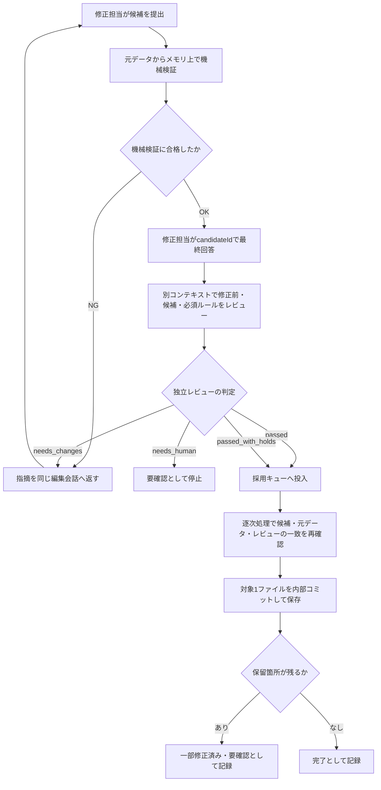

# 設計判断と初版の範囲

## 採用した構成

| 要素 | 決定 | 理由 |
|---|---|---|
| 処理エンジン | Go | Windows / macOSで共通のファイル処理・子プロセス・HTTP通信を実装し、実行形式で配布できる |
| 専用画面 | Wails v2 + React / TypeScript | フォルダ選択、進捗一覧、差分、設定を同じアプリにまとめる |
| CLI | `cmd/onebyone` | GUIと同じ`engine.Service`を呼び、自動実行やJSONでの結果取得に対応 |
| AI | OpenAI / AzureのResponses API、ClaudeのMessages API | ファイルごとの編集会話、ツール呼び出し、別コンテキストの独立レビューを制御する |
| 正規表現 | ripgrep | 各ルールの本文条件を同じエンジンで検証・照合する |
| 永続化 | JSONL + セッションJSON + 試行別ファイル | キューを直接確認でき、差分や中断履歴を保持できる |
| 変更の保存 | 専用Git worktree / ブランチ | 元のチェックアウトから編集を分離し、採用した1ファイルを1コミットとして記録する |

GUI用の関数APIとCLIを用意し、HTTPサーバーは追加していません。最初のワーカーは1つです。

## ワークスペースと画面

ワークスペースにエラーがあるときは、名前の右にエラーアイコンを表示します。吹き出し内の各エラーは、構造化されたタブ・ルールID・対象ファイルを使って該当明細へ移動します。読み込めないルールもIDで一覧に表示し、明細の「エラー詳細」で原因を確認できます。診断は起動時・切替時・アイドル時の更新で行い、実行中のポーリングとSnapshotでは再検証しません。

ワークスペースとルールのヘッダーにゴミ箱を置き、確認後に削除します。未保存の変更・実行中・他者の編集権限がある場合は削除しません。ワークスペースはアプリ保存先の`workspace-trash/<ID>-<一意ID>/`へ移し、対象ソースと外部キューは操作しません。ルール削除はそのIDを除いた新しいローカル版を作成し、旧版と実行履歴を保持します。不正なルールも1つずつ削除でき、残ったエラーは引き続き表示します。最後のルールを削除した後は未設定として新しいルールを追加できます。

左側は上に「LLM接続」、下に「ワークスペース」の一覧を置き、それぞれに「＋」を用意します。接続名を選ぶと独立したLLM設定画面、ワークスペース名を選ぶと「対象フォルダ → ルール → 実行設定 → 確認 → 結果確認 → コミット」の6タブを表示します。

ワークスペースの「＋」は新規作成に使い、作成済みのワークスペースは左メニューの名前で切り替えます。IDは固定し、表示名と対象フォルダは後から変更できます。「対象フォルダ」はパスと変更操作、「ルール」はMarkdown編集・JSON/CSV入出力・ルールごとの抽出条件、「実行設定」はLLM接続・処理上限・料金・対象ファイルの抽出と選択を扱います。「確認」は選択済みのファイルと候補ルールを表示して実行を開始する画面とし、「結果確認」で進捗・停止・差分・適用ルール・履歴を扱います。

対象フォルダ欄の下は、左に相対パス一覧、右に選択ファイルの本文を置きます。ファイル名を強調し、パス検索・更新・幅調整・個別スクロールに対応します。`ListTargetFiles`と`ReadTargetFile`はワークスペースIDと対象ルートを照合する読み取り専用APIです。ルールやキューから独立し、作業コピーではなく元の対象フォルダを表示します。Gitの管理ファイルと未追跡ファイルを列挙し、ignore対象の未追跡ファイル・`.git`・リンク・特殊ファイルを除外します。一覧は最大50,000件とし、画面にはスクロール付近の行だけを描画します。本文は最大1 MiBのUTF-8、表示は20,000行までとし、制限・非対応形式は明示します。ルート内に閉じたファイルハンドルで読み込み、切り替え前の非同期応答を画面に反映しません。

タブやワークスペースの移動前に、設定とルールの下書きを保存します。ルールの未保存状態は黄色の編集アイコンで表示し、保存ボタンは置きません。複数ルールを一括保存し、検証に失敗した場合は移動せず「ルール」に留めて該当項目を示します。

デスクトップ起動時は`CheckGitInstallation`で同梱Gitとhelper・templateの配置を確認し、4秒の期限付きで`git --version`を実行します。配布版で同梱Gitが不完全な場合は外部Gitへ切り替えず、`bundle_error`として再展開・再インストールを案内します。開発・テストのように同梱資材自体がない場合だけPATH上のGitを使い、macOSのシステムGitではCommand Line Toolsも確認します。「後で」を選んでも設定や結果の閲覧を続けられ、フッターから案内を開き直せます。再確認が成功したらワークスペースの診断を更新します。ブラウザーの画面プレビューではこの確認を行いません。

新規作成・対象変更のフォルダ選択時に、実体のあるフォルダでGitの作業ツリー内か、初回コミットがあるか、リポジトリ全体に未コミット変更がないかを確認します。サブフォルダとlinked worktreeも受け付け、選択範囲外も含めてステージ済み・未ステージの変更と未追跡ファイルを調べます。Gitで除外された未追跡ファイルは変更として扱いません。Gitを起動できない場合も含め、満たさない条件をフォルダ欄に表示します。検証は読み取りだけで、初期化・ステージ・コミットはしません。保存済み対象のGitエラーは`target`タブの診断として表示します。

フォルダ選択と実行開始は共通のGit検証処理を使い、選択後にソースの状態が変わった場合も開始時に止めます。作業コピーとの整合性や修正対象ごとのGit登録状態、変更案の整合性は、必要な実行情報がそろった段階で引き続き確認します。

既存の対象で未コミット変更などが発生しても、ルールや実行条件の設定保存は継続できます。対象を変更しない保存ではフォルダの構造・保存先との分離・Git管理下かを確認し、初回コミットや未コミット変更の問題は対象フォルダ欄の診断として残します。

対象の変更は専用APIで、停止中かつワークスペースの編集ロックを持つ場合だけ行います。ID・表示名・ルール・個人LLM接続の選択を保持し、新しいキュー保存先を内部で自動的に割り当て、現在の対象一覧と実行セッションを初期化します。以前のキュー・結果・worktreeには書き込みません。変更後は再抽出が必要です。

ワークスペースはアプリのローカル保存先に置きます。`workspaces/<ID>/setting.json`の単一JSONにバージョン・ID・表示名・処理設定を保存し、対象フォルダにはアプリ設定を作りません。起動時はこのローカル一覧から復元します。同じ対象フォルダを使う複数ワークスペースは、それぞれ独立した設定・キュー・結果を持ちます。キューと実行結果は`workspaces/<ID>/runs/`に自動配置し、保存先の指定欄や選択ダイアログは設けません。通常の設定保存では受信した`queuePath`で上書きせず、ワークスペースの現在の保存先を維持します。既存の保存先も移動せず引き継ぎます。結果レポートを書き出す際の保存ダイアログは、この内部管理とは別に維持します。

実行設定の処理上限・料金は画面下部の折りたたみ欄に置き、展開時も上のファイル一覧・内容の高さを維持します。新規作成時は全9項目を0（未設定）で保存し、画面は空欄にします。候補検証・独立レビュー・外側の試行回数、ターン数、処理時間は0なら上限なしです。出力トークン・ファイルサイズだけは、実行時に`model.Config.Effective*`で8,192出力tokens・524,288 bytesを補完します。料金・単価は自動設定しません。保存設定・チェックポイントの照合キーへ補完値を書き戻しません。

処理上限と料金は、そのJSONの`config`内にある`maxAttempts`、`maxTurns`、`maxOutputTokens`、`maxFileBytes`、`timeoutSeconds`、`maxCostUSD`、`inputPricePerMillion`、`cachedInputPricePerMillion`、`outputPricePerMillion`で管理します。GUIの設定欄は廃止し、既存値とCLIによる設定をワークスペースごとに保持します。既存ワークスペースの値は保持し、ルールファイルの読み込み・書き出しには含めません。

```text
OneByOne/
  app-settings.json
  private/
    master-key.json
    llm-settings/<暗号化された接続一覧>.json
  workspaces/<固定ID>/
    setting.json
    rule-versions/<版ID>/
      rules.json
    runs/...
  workspace-locks/<固定ID>/
    .edit.lock
    rule-locks/
```

設定JSONの更新は一時ファイルと置換で行います。同一ローカルワークスペースを別プロセスが開いた場合はOSロックで閲覧専用にし、切替・終了時に解放します。ロックファイルは`workspace-locks/<ID>/`に固定し、ワークスペース削除時の退避・復元中も保持します。Windowsで開いているファイルを含むディレクトリの移動を避けつつ、編集権限を途切れさせません。ワークスペースの複製は別ID・別の結果保存先を割り当て、選択したLLM接続IDだけを個人設定として引き継ぎます。

`setting.json`は`version: 2`だけを受け付けます。以前の形式の設定・ルールへの互換処理や自動変換は行いません。未定義の項目を含む設定は読み込みエラーにします。

### 個人用LLM接続

Windowsでは`%LOCALAPPDATA%/OneByOne/private/`、macOSでは`~/Library/Application Support/OneByOne/private/`に保存します。`ONEBYONE_CONFIG`はアプリ設定とワークスペースの場所を、`ONEBYONE_PRIVATE_DIR`は個人LLM保存先を指定します。

接続には固定IDと表示名があり、複数ワークスペースから同じ接続を選べます。接続一覧は暗号化した個人データに保存します。選択した接続のIDだけを各ワークスペースの`setting.json`に保存し、接続先や認証情報は含めません。接続IDも結果やルールファイルには含めません。複数アプリの変更は個人保存先のロック下で最新データへ反映します。待機中の画面更新は他アプリの変更を読み直し、実行中は開始時の接続を保持します。

初回に暗号学的乱数で32バイト鍵を生成し、接続名・プロバイダー・接続先・モデル・認証方式・認証情報をAES-256-GCMで暗号化します。Windowsは鍵を現在のユーザーのDPAPIで保護します。macOSは所有者のみがアクセスできるディレクトリ`0700`・ファイル`0600`を使います。macOS Keychainは使いません。同じユーザー権限の別プロセスや管理者から隔離する方式ではなく、macOSで鍵と暗号化データを両方取得できる人は復号できます。

接続一覧の形式・復号・内容検証に失敗した場合は、その暗号化ファイルだけを破棄して空の一覧を返します。非対応バージョンの自動取り込みは行いません。読込・検証・破棄・更新は同じOSロックで直列化し、待機中に別プロセスが正常な内容へ更新したファイルを消さないようにします。権限・入出力エラーやリンクなどの不正な保存先はエラーにし、キー、ワークスペース、無関係ファイルは変更しません。

接続自体を削除すると、参照元のワークスペースでは次の更新・読込時に選択を無効化し、接続先や認証情報をクリアします。選択変更は専用APIでワークスペースの編集権限を確認し、`setting.json`のIDを更新します。一般の設定保存APIへIDを渡しても、選択の変更には使いません。「保存済みの認証情報を削除」は接続を残してキーやトークンだけを空にします。環境変数のキーは保存せず実行時に利用するため、保存済みキーの削除後も環境変数で認証できる場合があります。

プロバイダーは`openai`・`azure`・`claude`です。Responses APIとMessages APIの違いはクライアント内で吸収し、編集提案・ツール制限・検証・再試行を共通化します。

## ルール定義

### 同梱デモ

`internal/demopreset/`に、28ファイルのJavaScriptプロジェクトとソース全体向け3件・本文条件付き10件のMarkdownルールを同梱します。新規作成ダイアログで保存先を選ぶと、新しい子フォルダに資材と独立したGitリポジトリ・初回コミットを用意します。ダイアログからデモのワークスペースを作成すると、`CreateDemoWorkspace`がルールと処理設定を自動導入します。検証済みのワークスペースだけを選択状態にするため、途中の失敗で既存ワークスペースを置き換えません。

`src/orders/`・`billing/`・`jobs/`・`ui/`・`shared/`・`workflows/`に23対象ファイルを配置し、残り5ファイルはAPI実装や資料です。主要10ケースは約40〜65行で、finallyによる解放、購読の所有権、非同期ページ走査、flush・確認応答の順序、冪等性、検証と副作用の分離を扱います。複合ケースに加え、変更不要4件と判断保留4件を含みます。題材の詳細は[デモREADME](../internal/demopreset/project/README.md)を参照してください。

`src/shared/host-transaction.js`は部分採用のケースです。関数内で所有権が完結する下書き保存と、外部ホストが所有する編集ハンドルを同居させます。同じトランザクションのルールに対し、前者は移行して確実に解放し、後者は契約が不明な箇所として旧APIとともに残します。ルールにこのファイル専用の答えは追加せず、既存の所有権・保留条件から判断させます。

`src/workflows/dispatch-cycle.js`は、配送・在庫・決済・帳票を統合し、全13ルールの変更が必要な大型ケースです。全ソース向けルールのvar・nullish既定値・import整理も含めて修正箇所を持ち、正規表現の一致だけで網羅と判断しません。新規デモワークスペースも処理上限・料金は未設定です。未指定の回数・ターン・時間に暗黙の上限は設けず、デモルールファイルにも含めません。既存ワークスペースへのデモルール導入では処理上限・料金を維持します。

利用中のSDKは `lib/parcel-kit.js`、後継は `lib/parcel-client.js` です。API名も `TransactionManager`、`RecordDirectory` など用途を表す名前にし、廃止対象であることを名前で示す目印は付けません。ルールは対象固有の変数名や処理手順を指示せず、APIの引数・戻り値・寿命・副作用・失敗時の契約を記します。変更前後の例は対象と異なる用途の短い関数で、対象ファイルの完成実装は渡しません。回帰テストは例と対象全文の一致、対象の公開関数名の混入、ルールの抽出漏れを検出します。振る舞いを検証する参照実装は開発用の`testdata/`に分離し、生成するプロジェクトやルールファイルには含めません。このテストは実際のAI出力の評価とは別です。

デモ作成・ルール導入はオフラインで、独立したルール読込操作は不要です。「実行設定」を開くと通常の抽出処理を行い、LLM接続と処理するファイルを選びます。「確認」では再抽出せず確定した一覧から開始し、実行結果は実際のAI判断と検証から記録します。`?demo=1`の画面プレビューとは独立した実ファイル操作です。

標準チェックはGit・編集範囲・候補の整合性と独立レビューを使い、追加の言語ランタイムを必須にしません。ソースの言語的な正しさはその検査だけでは保証できません。曖昧な仕様や変更不要の題材を含めますが、失敗やすべての最終状態を強制する処理は設けません。

### JSON・Markdown形式

公開ファイルはUTF-8の`rules.json`で、`{"rules":["YAML front matter付きMarkdown", "..."]}`という文字列配列だけを持ちます。`.oborules`・ZIP・個別`rule.json`・旧シンボル定義ファイル・検証コマンドは廃止します。旧形式の読込・自動変換は行いません。

各Markdownの先頭に`---`で囲むYAML front matterを置きます。`id`・`name`・`description`は空白以外の値が必須、`path_pattern`と`content_pattern`は任意です。本文は自由形式のMarkdownで、固定の見出しへ再構成しません。`description`は索引用の説明、本文はLLMへの詳細な指示として使います。ルール名は1〜200文字、各ルール4 MiB以内、文書全体32 MiB以内、最大5,000件です。

JSON/CSVを共通のルール定義へ変換し、構造・必須値・glob・正規表現を検証してからローカルの新しい版へ保存します。保存先は`rule-versions/<版ID>/rules.json`です。単一`setting.json`の置換で採用し、途中の失敗では従来の設定と資材を保持します。

ルールIDはfront matterの`id`です。英数字で始まる64文字以内の英数字・ハイフン・アンダースコアで、文書内では大文字・小文字を区別せず一意にします。ロックファイル名・コミット記録・LLMのツール引数にも使うため、作成後は変更できません。名前や本文を変更しても履歴との対応は保たれます。数字の連番を推奨し、画面の新規作成とIDを省略したCLIの作成では次の番号を割り当てます。保存済みの版では、他の項目が不正でもIDを読めるルールは個別に表示・削除できます。IDを読めない文書は全体を読み込みエラーとし、上書きインポートで修復します。実行時の定義もスナップショットへ保存します。JSON書き出しにはロック・LLM接続・対象フォルダ・上限・料金・実行結果を含めません。

### ルール編集と競合検出

詳細画面はID・名称・説明・対象ファイル・内容の条件とMarkdown本文を表示します。IDは新規作成時だけ編集できます。一覧・詳細・参照パネルのアイコンは条件の指定状態を示し、パスのみはフォルダ（黄）、内容のみは文字入りのファイル（青）、両方空欄は共通のアスタリスク（緑）、両方指定は箱（赤）をパステル調で表示します。ホバーで「パス」「内容」「共通」「パス＋内容」をチップ表示します。固定の本文項目や共通の詳細設定はありません。本文は「Preview」を初期表示し、「</>」で原文に切り替えます。原文側だけで編集でき、プレビューは未保存の本文をMarkdownとして表示します。閲覧専用でも原文を確認できますが編集はできません。実行・結果画面で参照する明細も同じMarkdown表示を使います。本文内のHTMLを実行せず、画像URLの自動読み込みもしません。

ID・名称・説明が未入力、またはIDが不正・重複した下書きがある間は次へ進めません。ルール選択を外したときや進行操作時に一覧へエラーアイコンを出し、詳細にも原因を表示します。下書きはワークスペースIDとルールIDにひも付けて保持し、選択変更・検証失敗で消しません。

編集開始時に`workspace-locks/<ID>/rule-locks/<小文字ルールID>.lock`を保持します。閉じる・別ルールやワークスペースへの切替・アプリ終了・インポート成功時に解放します。画面移動時の`SaveRules`はすべての下書きを一括検証し、全対象の編集権限とリビジョンを照合して新しい版を採用します。既存ルールの更新は名称・説明・パターン・本文を含むリビジョンが必須です。失敗時は以前の設定と下書きを保持します。

### インポート・マージ・CSV

ルール追加ボタン右の「…」にJSON/CSVインポートとJSON書き出しを置きます。`ImportRulePackage(path, mode)`の`replace`は一覧を置き換え、`merge`は既存ルールを残して追記します。IDはファイルの値を使い、`merge`で既存と重複したIDには`_2`、`_3`…を付けます。どちらも対象フォルダ・LLM接続・上限・料金・キューと過去の実行履歴を変更しません。

CSVには`id,name,description,path_pattern,content_pattern`の5列が必要です。値が必須なのはid・name・descriptionで、IDの重複も拒否します。パターンは空欄にできます。それ以降の各列はヘッダーをH1、セルを本文とし、元の列順にMarkdownへ変換します。UTF-8 BOMと引用符内の改行・カンマを扱い、重複ヘッダー・列数の不一致・不正な定義は行番号付きで拒否します。GUIとCLIは共通のパーサーを使います。

## 対象の決まり方

1. 指定フォルダをrgで列挙し、アプリの固定除外を適用する。
2. 実行設定で選択した各ルールの`path_pattern`を対象フォルダ基準の相対パスに、`content_pattern`を本文に照合する。空欄の条件は一致として扱い、両方指定された場合はANDで判定する。
3. いずれかのルールに一致するファイルをキューへ載せ、候補のルールIDをJSONLの`rules`へ保存する。両パターン空の共通ルールがあれば固定除外後の全ファイルが候補になる。
4. 利用者が実行設定画面で選択したファイルを確認画面に表示し、そのうち`pending`・`failed`と、選択によって再試行へ戻した`needs_human`を実行する。

「実行設定」への移動前に下書きを保存し、対象フォルダ・ルールと編集権限を確認して`Scan`を自動実行します。対象やルールのエラーがある場合は該当画面に留めます。LLM接続はこの画面で選択でき、未選択の間は確認・実行を許可しません。 適用ルールもこの画面で選択します。未選択IDは`config.excludedRuleIds`に保存し、初期状態は全選択です。選択変更後は「対象を更新」で再抽出します。対象ファイルの候補・修正コンテキスト・独立レビューには選択したルールだけを含め、ルール定義の一覧は全件を維持します。全解除でも実行設定は開けますが、確認・実行へは進めません。

タブ・フッターの「前へ」「次へ」・通常の画面遷移処理は同じ遷移先の有効条件を使います。「確認」は最新の対象選択と処理可能なファイルがある場合のみ開けるため、処理完了後にタブが無効なら「前へ」も無効です。エラー箇所への直接移動は、問題を確認できるよう別に扱います。

初回抽出のファイルはすべて選択済みです。チェックを外した状態を`Task.excluded: true`としてJSONLに保存し、省略・falseは選択済みとします。通常の選択更新は状態・試行回数・履歴を変えません。選択した`needs_human`だけは`pending`・`resumeRequested: true`へ戻し、保存済みの計画と履歴を引き継ぎます。確認へ進む際はチェックに変更がなくてもこの処理を行います。完了済みは選択更新だけで再実行しません。同じキューの再抽出では既存ファイルの選択を引き継ぎ、新しく見つかったファイルは選択済みにします。未保存の選択は設定保存や再抽出より先に保存します。対象フォルダ変更時は内部の保存先を分離し、再抽出した一覧の選択を実行設定で確認します。別の対象フォルダやワークスペースへファイル名だけを使って選択を引き継ぎません。

実行設定と確認は同じファイルブラウザーを使います。本文は次回の処理入力を表示し、実行用の作業コピーがある場合はその現在の内容を使います。対象フォルダ画面は引き続き元ソースを表示します。実行設定の一覧は、ファイル名の左が対象チェック、行の右端が状態です。左一覧の候補ルールIDは省略します。本文ヘッダーにも候補ルールと状態を表示し、ルールIDをクリックするとさらに右に読み取り専用の詳細を開きます。確認画面ではチェックを変更できません。次へ・前へ・タブ・実行の禁止理由と有効判定は同じ状態から生成し、無効な操作はホバー・キーボードフォーカスで理由を示します。

「確認」への移動時は選択を保存し、選択済みの一覧を読み取り専用で表示します。この画面で`Scan`を実行したり、チェックを変更したりしません。選択件数と実行可能件数を区別し、実行可能な処理対象が0件の間は開始を無効にします。対象を変更する場合は「実行設定」へ戻ります。

フロントエンドは抽出成功時のワークスペースID、対象フォルダ、キュー保存先、ルール保存先・ID・名称・説明・本文・両パターン・除外ルールID・ファイルサイズ上限を記録します。現在の設定との一致を確認画面への移動時と実行前に照合し、不一致なら実行設定での再抽出を要求します。抽出失敗時に以前の一覧が残っていても、抽出成功とは扱いません。LLM接続だけの変更では再抽出しません。バックエンドも開始時にGit状態・カタログハッシュを、各ファイルの処理前に入力ハッシュを検査します。

開始後は「結果確認」に移動します。GUIにJSONL読込機能は置かず、通常の対象管理は実行設定画面で完結させます。

固定除外には`.git`、依存関係・ビルド出力、エージェント設定、代表的な認証ファイルを含みます。`.gitignore`やユーザーのrg設定は読み込みません。サイズや文字コードが未対応の候補ファイルは台帳へ残し、理由を示して`needs_human`として扱います。

`path_pattern`はglob（例: `src/**/*.tsx`）、`content_pattern`は正規表現です。対象抽出にのみ使用し、修正後にも同じパターンの消失を要求することはありません。残してはいけないコードや振る舞いは本文に記載し、LLMの独立レビューで評価します。

## 結果画面の情報構成

上部に現在の状態・進捗と件数をまとめ、ファイル一覧と選択したファイルの詳細を同じ画面に置きます。一覧は実行設定と同じコンポーネントを使い、相対パス内のファイル名を強調し、右端に状態を表示します。状態やファイル名・ルールで絞り込めます。ファイルをクリックすると変更内容、詳細ヘッダーの適用ルールをクリックするとルールの内容を表示します。差分のない試行は「変更前」を初期表示し、差分があれば状態に関係なく「差分」を選択します。同じファイルを見ている間の手動切替は更新時も維持します。 選択中の詳細はバックグラウンドで取得し、表示を読み込み画面に置き換えず最新データを反映します。レビュー・計画の更新や完了も反映し、選択ファイル・タブ・開閉・スクロール位置を維持します。実行中の取得は直列化し、遅れた別ファイル・別実行の応答を採用しません。適用前の候補IDを適用済みとして表示しません。

ファイルの`pending`は「未修正」、`pending`かつ`resumeRequested`は「再試行」と表示し、一覧は再試行・処理中・未修正・失敗・要確認の順、同じ状態ではパス順に並べます。`done`（完了）と`skipped`（変更不要）は「完了済み」にまとめ、初期状態は閉じます。「完了済み（件数）」の開閉バーは通常ファイルと完了済みファイルの境界に置きます。境界が表示範囲より下にある間だけ下端に留まり、境界までスクロールすると本来の位置へ移動します。展開したファイルはバーの直後に表示し、仮想表示とスクロール領域は一覧全体で1つにします。全件完了済みの場合はバーが一覧の先頭になり、未完了の空欄は表示しません。実行設定でも完了・変更不要にはチェックボックスを置かず、その位置の戻すアイコンで再試行に追加します。修正済みコードと履歴は保持し、選択済みの再試行として上部に戻します。実行開始時に`resumeRequested`を解除します。再抽出・再起動後もこの状態は保持されます。結果画面の一覧には処理対象のチェックボックスを置かず、同じ並び順と完了済み欄・再試行操作を提供します。

結果確認の上部で実行履歴を選択します。実行ボタンを押してから終了・停止するまでを1つの実行IDで管理し、内部の自動再試行は同じ実行に含めます。初期選択は最新で、新しい実行が始まると追従します。明示的に過去の実行を選んだ場合はその選択を維持します。実行日時・終了状態・対象件数を選択肢に表示します。

結果一覧の通常領域には選択した実行の対象ファイルを置き、完了・変更不要になってもその場に残します。その実行では対象外だった以前の完了・変更不要だけを「完了済み」に折りたたみます。進捗と状態別件数は選択した実行の対象だけで集計します。実行設定側の一覧は引き続き現在のキュー状態で分類します。

実行の対象・設定・ルール・結果状態を端末内に保存し、過去の実行には後日の再試行や変更破棄を混ぜません。累積本文は保存した不変Gitコミットを基準に選択ファイルだけ読み込み、再開で上書きされ得る個別試行の証跡は実行終了時に保全します。準備失敗や停止も実行として記録します。過去の実行は閲覧専用で、出力は選択した実行の内容を保存します。実行IDのない従来の記録には架空の実行単位を割り当てず、従来のファイル単位表示で確認できます。

再試行で追加修正が不要と確認でき、以前に採用した差分が残っている場合は、ファイルの状態を「完了」にします。今回の試行は`skipped`のまま保存し、追加の修正・コミットがなかった記録を維持します。初回から変更が不要な場合、変更を破棄した場合、採用した差分が相殺されている場合は「変更不要」です。失敗・要確認は以前の修正が残っていても「完了」にしません。一覧・詳細ヘッダー・件数・絞り込みをこの判定に揃え、詳細では「追加修正なし・以前の修正を保持して完了」と案内します。

一覧の初期幅は文字の長さと表示領域から決め、長いパスで右詳細を圧迫しないよう上限を設けます。境界のグリップはドラッグとキーボードで幅を調整できます。詳細ヘッダーにはファイル名と適用済みルールIDを並べ、その直下に選択中の試行の説明を常時表示します。説明は変更内容・検証・履歴タブの外側に置き、折り畳み操作を不要にします。

「変更内容」に対応状況を統合し、最初の処理開始前から、選択した実行時点の採用済み内容までを比較します。実行中は現在までの採用済み内容を表示します。再試行で追加修正がなくても、それ以前の修正と対応状況を表示します。未採用の提案や検証中の一時編集は累積差分に含めず、変更破棄以前の修正も除きます。採用済みの対応内容を試行ごとに区別して集約し、最新試行の要確認・未反映も併記します。最終差分から消えた修正は除外し、行位置を最初の変更前・現在の変更後に対応付けます。対応を確定できない行にはマーカーを付けません。詳細の「試行履歴」から個別の試行を選ぶと、当時の差分・対応状況を確認できます。「検証」は選択した試行、初期状態では最新試行の結果を表示します。

差分の修正箇所ではルールIDを縦に並べ、それぞれの横にルールの説明、その下に修正担当LLMが記録した具体的な修正内容（`change`）と状態を表示します。採用時の定型文（`reason`）や判断の詳細（`risk`・`expected`）はコード上には表示しません。前N・後Nの文章による位置表記は出さず、コードの行番号で位置を示します。行との対応を確定できない記録は変更内容の上部に表示し、要確認などの情報を失わないようにします。各試行の`changes`には`id`・`ruleId`・`ruleTitle`・`location`・`risk`・`change`・`expected`・`status`・`reason`・`lineRanges`を保存し、出力JSONにも含めます。状態は修正済み・要確認・未反映・確認中・変更不要を区別します。修正済みにできるのは、対応する候補の検証・独立レビュー合格とコミットを照合できた項目だけです。AIの提案や対応申告だけで修正済みにしません。リスクの説明はコードとルールに基づくAIの判断記録です。過去の試行では当時のルール名と対応内容を保持し、記録がない情報は「未記録」と表示します。

結果の行別ルール表示は、`validate_candidate`の各編集に渡す計画項目ID（`itemIds`）から対応付けます。ハーネスが一意な置換位置をもとに変更前後の行範囲を計算し、候補記録・試行の対応状況・JSONレポートへ保存します。差分では連続した削除・追加行を1つの変更箇所として、各ルールIDを記録範囲に一致する最初の行の上に1回だけ表示します。変更のない行やhunk境界を挟んだ別の箇所では再表示します。変更前・変更後を単独表示する場合は、それぞれの行位置で表示します。ルールIDにホバーすると名称、クリックすると右端にその実行時点のルール定義を開きます。ルールIDは選択した実行で採用された修正を紫、以前の採用済み修正を青灰色で表示し、凡例とホバーの説明を付けます。対応状況・差分・詳細ヘッダーの色を揃えます。由来の試行ID（`sourceAttemptId`）と試行の実行ID（`executionId`）で判定し、同じ実行に複数の試行があっても同じ色にします。選択した実行で追加修正がなければ、以前の修正は過去の色です。同じ変更箇所で同じルールに両方の由来がある場合はIDを1つにまとめ、紫と両方を含むホバー説明を表示します。未採用の提案や由来が分からない項目は最新の修正として色付けしません。対応内容が空の行は対応状況の表示・件数から除外します。行の対応情報を持たない過去の記録には、説明文から推測したマーカーを付けません。

要確認の既知箇所は、修正担当の計画に原文の行範囲とコード引用を、独立レビューの指摘に修正前または候補の行範囲と引用を持たせます。実際の本文との一致を検査してから対象行を記録します。変更がないファイルも、結果画面の「要確認」から理由とルールIDを確認し、該当行へ移動できます。差分の未変更行にも要確認を表示します。累積表示へ確実に対応付けできない候補固有の指摘は個別試行の候補で表示し、採用済みのコードへ誤って貼りません。行情報のない過去の記録やファイル全体の保留は、その旨を表示し、推測で行を補いません。

検証結果・過去の試行・使用量などの補足は必要な項目を開いて確認します。独立レビュー中は進捗欄にその状態を表示し、「検証」と「履歴」で各レビューの判定・指摘箇所・ルール別評価・使用量を展開できます。修正後に合格しても、それ以前の要修正の記録は残します。失敗や保留は理由と差分へたどれるようにし、停止・再試行・結果出力もこの画面に置きます。除外したファイルの結果も保持します。計画から導出した適用ルールは調査の手がかりであり、正しく適用されたことの証明ではありません。

## ルールとコンテキスト

起動・実行準備時に`rules.json`を読み、両パターン空の共通ルール全文と個別ルールの索引を決定的な順序で組み立てます。索引にはID・name・descriptionを使い、自由Markdown本文は固定見出しに変換しません。共通ルール、`read_rule`/`read_rules`、独立レビューは同じ本文を参照します。path/content条件は抽出用メタデータとして扱います。

定義は実行開始時のスナップショットを使い、途中のディスク変更で指示を差し替えません。独立レビューと過去結果にもその実行の定義を保持します。

確認タブの実行ボタン左に「並列数」の数値入力と−／＋ボタンを置きます。1〜10、初期値2でワークスペースに保存し、実行中は変更できません。並列数だけの変更では対象を再抽出しません。

ファイルごとの修正・機械検証・独立レビューは設定した並列数で進め、採用と台帳更新は1つのイベントキューで順番に反映します。作業コピーは1つのままです。対象本文と周辺コードは実行開始時のGitコミットから読み、途中で採用された別ファイルの変更はその実行のLLM入力へ混ぜません。結果画面には各処理中ファイルと工程を表示します。

1ファイルごとに独立した会話を作ります。修正前に`update_state`で共通・候補ルールすべての判断と箇所別の計画を登録し、`validate_candidate`の検証不合格は同じ会話へ返します。中断後の明示的な復帰では、保存済みの計画・候補・検証結果・既読ルールを新しい会話へ渡します。別ファイルの履歴は引き継ぎません。固定プレフィックスによりキャッシュ可能性を高めますが、キャッシュ成立や料金比率はモデル・サービス側の条件に依存します。

計画の各項目には、場所と修正内容に加えて`risk`、期待条件、`holdReason`を記録します。保留する項目は`blocked`にし、原文の行範囲と実コードを指定します。保留箇所を変更せず、それ以外の修正が独立して成立する候補は部分採用できます。保留箇所を特定できない場合や、修正が保留事項の解決に依存する場合は候補全体を保留します。部分採用後もファイルは「要確認」とし、修正済みと保留箇所を同じレポートで確認できます。

修正担当のツールは`read_rules`、`read_rule`、`read_context`、`update_state`、`validate_candidate`の5つです。複数の個別ルールは`read_rules(ids[])`でまとめて取得します。1回1〜32個の既知・重複なしIDを事前検査し、UTF-8の本文をID別JSONとして返します。出力はJSON化後96 KiB以内で、全件成功したときだけ既読キャッシュへ反映します。取得失敗や上限超過で一部だけ既読にしません。共通ルールの全文と成功済み本文は再利用し、適用判断は個別に行います。

検証ツールには元ファイルのハッシュと元本文に対する置換案全体を渡します。候補はメモリ上で検証し作業コピーを変更せず、最終応答の`candidateId`に対応する内容を独立レビューへ渡します。自由な書込・コマンド実行権限は与えません。編集担当への各要求には、この実行での使用数・上限・今回の要求を含む残りターンを固定プロンプトの後ろへ付けます。最終回答後の独立レビュー分を確保し、不要な再読込や状態表示だけの計画更新を避けるように伝えます。

独立レビューは同じ選択済みLLM接続・モデルで、新しい1要求の会話を作ります。修正前全文、候補全文、両方のハッシュ、元ファイルのパス・内容で確定したルールのID・名称・説明・Markdown全文を渡します。修正担当の会話履歴、修正計画全体・説明、機械検証結果、過去のレビュー指摘は含めません。部分採用の場合だけ、検証済みの限定された保留範囲・項目ID・ルールID・理由を追加し、保留箇所をそのまま維持できるか、採用する修正が独立して成立するかを評価します。レビュアーにツールは渡さず、必要な仕様が不明な場合は判断保留にします。

## 検証と採用

機械検証では元ファイル・候補・計画のハッシュと編集範囲を照合し、対象1ファイルへの妥当な変更案だけを受け付けます。旧シンボルの残存検査や利用者指定のビルド・テストコマンドは実行しません。Markdownに記載した禁止条件も含め、ルール適合性は独立レビューで確認します。


```mermaid
flowchart TD
    Candidate["修正担当が候補を提出"] --> Mechanical["元データからメモリ上で機械検証"]
    Mechanical --> Pass{"機械検証に合格したか"}
    Pass -->|"NG"| Feedback["指摘を同じ編集会話へ返す"]
    Feedback --> Candidate
    Pass -->|"OK"| Final["修正担当がcandidateIdで最終回答"]
    Final --> Review["別コンテキストで修正前・候補・必須ルールをレビュー"]
    Review --> Verdict{"独立レビューの判定"}
    Verdict -->|"needs_changes"| Feedback
    Verdict -->|"needs_human"| Hold["要確認として停止"]
    Verdict -->|"passed"| Queue["採用キューへ投入"]
    Verdict -->|"passed_with_holds"| Queue
    Queue --> Match["逐次処理で候補・元データ・レビューの一致を再確認"]
    Match --> Commit["対象1ファイルを内部コミットして保存"]
    Commit --> Status{"保留箇所が残るか"}
    Status -->|"あり"| Partial["一部修正済み・要確認として記録"]
    Status -->|"なし"| Done["完了として記録"]
```

レビューは全必須ルールを各1回評価し、`passed`・`passed_with_holds`・`needs_changes`・`needs_human`の判定を返します。`passed_with_holds`は、事前に範囲を特定した保留箇所が維持され、保留以外の修正を安全に採用できる判定です。保留項目ごとの`holdAssessments`がすべて`preserved`で、保留範囲以外に違反がないことを必須とします。指摘は修正可能か人の確認が必要かを`kind`で区別し、ルールID、箇所、修正前後のどちらかに実在するコード断片、理由、修正方針を含めます。未知のルールID、評価漏れ、架空の引用、保留を解決済みとする合格を拒否します。要修正なら同じ編集会話で新しい候補を作り、機械検証・新しい独立レビューを受け直します。安全に分離できない判断保留、通信・保存・応答形式のエラーでは候補を採用しません。

採用時は機械検証の結果に加え、同じ候補ID・ハッシュ・元ファイル・計画Revisionに対するレビュー合格を照合します。元コード・ルール・設定の変更や別候補の合格を使った採用は拒否します。採用直前に作業コピーがアプリの既知のHEADで、未記録の変更がなく、対象ファイルの内容が元データと同じことを確認し、合格した候補を反映して内部コミットします。実行開始時の参照コミットは`baseCommit`、実際のコミット親は`commitBase`として区別します。途中の採用を中断した場合も、他ファイルの採用済み変更を残して復旧します。部分採用は`Attempt.partial: true`とコミットを記録し、試行とファイルは`needs_human`のままにします。採用した項目は修正済み、保留項目は要確認として行に紐付けます。再試行では採用済み試行を上書きせず、部分修正後の本文から新しい試行を始めます。累積差分・変更破棄・コミット用レポートにも採用済みの部分修正を含めます。最終反映は、利用者が結果を確認した後に「コミット」タブで新規ブランチへ1つのコミットとして行います。

最初から変更不要と判断したファイルも、変更前と同じ本文を独立レビューへ渡します。レビューの指摘後に計画を取り下げて`skipped`へ切り替え、指摘を回避することはできません。アプリ外のビルド・テストを実施済みと報告することはありません。

候補検証と独立レビューには、それぞれ`maxAttempts`（1〜3回）の上限を設けます。ターン・処理時間・ツール・読込量・検証回数・レビュー回数は、GUIの実行操作またはCLIの`run`で開始する1回の実行につき、ファイルごとに0から数えます。同じ実行中の修復・自動再試行・独立レビューは同じ枠を使います。`maxCostUSD`はファイル通算の料金で判定します。レビュー分の残りターン・費用・時間がなければ採用せず停止します。

ランナーは各ファイルの処理開始時に、台帳とチェックポイントの通算カウンターを照合し、その実行の基準値を1回だけメモリに保持します。上限判定には通算値と基準値の差を使います。基準値は実行中だけ保持し、状態ファイルに実行IDを追加しません。`RetryTasks`は対象を`pending`に戻す操作で、過去のターン数では拒否しません。次の実行では新しい基準値を使うため、再開のためだけに上限を増やしたりキューを作り直したりする必要はありません。ツール・検証・最終回答・レビューの拒否理由は実行ログへ記録し、直前の未解決の拒否は今回の使用数と上限を示すエラーにも添えます。

`rulesApplied`は計画で変更すると判断されたルールからアプリが導出します。適用の正しさの証明ではありません。集計・部分再実行・調査の手がかりに使用します。

## コミット

作業コピーでは採用したファイルごとにコミットし、再試行や変更破棄の履歴を保持します。「コミット」は、その処理開始時のコミットから現在の採用済み内容までを、新規ブランチの1コミットにまとめる操作です。結果確認で選択中の過去の実行だけではなく、現在の作業コピー全体の累積結果を扱います。最初と同じ内容に戻ったファイルや未採用の候補は反映しません。

新規ブランチ名を提案し、ユーザーが変更できます。コミットタイトルは必須で、本文には全体の対象・修正済み・修正不要の件数、ファイルごとのLLM変更概要を表示し、各ルールのIDとTitle（名称）をH4見出しにして「修正の内容」「修正後レビュー結果」を太字見出しで全文表示し、編集可能にします。修正の内容はコミット済みの採用履歴の`fixed`項目から収集し、同じルールの複数の修正も記載します。失敗案・未反映案は含めず、古い履歴に内容がなければ「修正内容の記録なし」と表示します。各ファイルのH2見出し直前に区切り線を置きます。未完了・要確認は修正不要に数えません。ファイルパスはリポジトリ相対のMarkdownリンクとし、リンク表示の可否はGitクライアントに依存します。候補ルールや変更不要と判断したルールは適用実績として記載しません。コミット本文のPreview内のファイルリンクを選ぶと、右から差分パネルを表示します。左端のグリップで幅を変更でき、閉じるボタンまたはEscapeキーで閉じます。常設のファイル一覧・差分欄は設けず、差分本文は選択されたファイルだけ読み込みます。リンクはバックエンドが返すリポジトリ相対パスと完全一致したものだけを対象にします。

プレビューにはワークスペースと採用済み状態に対応するrevisionを付け、反映時に照合します。閲覧後に修正・破棄などで内容が変わった場合は、差分を確認し直すまで反映しません。実行中・閲覧専用・作業コピーの未コミット変更や未知のコミット・既存の反映先ブランチがある場合も拒否します。

新しいコミットの親は処理開始時のコミット、ツリーは採用済みの最終状態です。作業用ブランチのコミット列はそのまま残します。反映先はチェックアウトせずに作成するため、元の対象フォルダとブランチの内容は維持され、SourceTreeなどで反映先ブランチへ切り替えて確認できます。元ブランチへのマージやリモートへのプッシュは利用者が行います。反映先・コミット・タイトル・本文をローカルに記録し、途中で終了した場合も作成済みブランチを上書きしません。

## 保存・再開

結果詳細の「変更破棄」は、対象ファイルだけをセッションの最初のコミットの内容へ戻す操作です。専用作業コピーに取り消しのコミットを追加し、Git履歴・元の対象フォルダ・他ファイルを維持します。実行中、閲覧専用、未コミット変更や未知のコミットがある場合は拒否します。最新試行が変更不要でも、過去の採用済み変更が残っていれば操作できます。

破棄の準備記録をキューへ先に保存し、コミットと完了記録の間に中断しても同じ操作として復旧します。破棄記録はAIの試行回数に含めず、「履歴」に別項目で表示します。完了後は対象を再試行へ戻し、適用中のルールIDを空にします。破棄以前の計画・候補を次の実行へ復元せず、過去の試行・差分・通算料金は保持します。

キューの選択・除外・履歴、試行前後のファイル、差分、独立レビューの判定・指摘・使用量、セッション情報をアプリが管理するローカル`workspaces/<ID>/runs/`（既存ワークスペースは記録済みの保存先）に永続化します。独立レビューは試行の`reviews`と`<attempt-id>.review-<review-id>.json`にも保存します。ファイル更新は一時ファイルと置換で行い、同じキューの多重実行はロックします。GitコミットとJSONLは単一トランザクションにはできないため、試行ID、前後のハッシュ、コミット親と編集範囲を照合して中断から回復します。一致を確認できない変更は自動で消さず停止します。

同じキューで再開するには元のコミットと作業コピーの対応が必要です。元のソースを別コミットに変更した場合は、ワークスペースを新規作成または複製して開始します。ルール変更はハッシュで検出し、対象の再抽出を要求します。手動での再実行は計画・履歴・通算使用量を保持し、未完了の修復には同じ試行IDを使います。上限判定のターン・処理時間・ツール・読込量・検証回数・レビュー回数は、実行開始ごとに0から数えます。過去の使用ターン・トークン・推定料金は履歴として保持し、料金上限と使用量不明時の制約は引き継ぎます。**`maxTurns`だけを変更した場合も、計画・候補・既読ルール・試行IDを維持します。** 元コード・基点コミット・ルール・その他の設定が変わると、計画・候補・既読ルールを無効化して再計画します。独立レビュー待ちで停止した場合は、元データが同じなら保存済み候補のレビューから復帰し、修正担当の作業を繰り返しません。

既存worktreeの再抽出は選択・除外と完了履歴を維持し、新しい対象範囲から外れた未完了ファイルは`needs_human`として自動処理から除外します。内部JSONLはワークスペース単位で自動管理し、CLIも`--workspace`で選択した設定・キューから再開します。外部キューを`--queue`で読み込む操作は設けません。接続先・認証はそのワークスペースで選択した個人接続を使い、実行設定の保存では個人接続の定義を書き換えません。

API使用量を取得できなかった試行は`Usage.uncertain`を永続化します。使用量が不明な要求は自動再送せず、明示的な再実行が必要です。費用上限が有効な場合は使用量を確認できないため、再実行を指定しても追加送信を停止します。詳細なループ・復帰条件は[AIハーネス](ai-harness.md)を参照してください。

## 初版の制約

- UTF-8のみ。BOM・LF・CRLFを保持し、非対応文字コード・改行混在・バイナリ・サイズ超過は確認対象にする。
- 複数ファイルの同時編集は行わない。同期から非同期への波及など、1ファイルで成立しない変更は保留する。
- パス・内容の条件で拾えない呼び出し元や、別名・リフレクションなどの意味解析は自動で網羅できない。
- 内容の正規表現はコメントも含めて照合する。言語別のコメント除去やAST解析は未導入。
- 新旧混在状態でビルドが通らない移行は、検証方法か移行単位を別途設計する必要がある。
- 独立レビューもLLMによる判定であり、意味的な正しさの保証ではない。編集と同じモデルを使うため共通の見落としは残り、対象プロジェクトの動作テストを併用する。
- 対象プロジェクトのビルド・テストはアプリ内では実行しない。独立レビューだけで言語・実行時の正しさを保証しない。
- 料金は設定単価とAPI報告からの推定。送信済みリクエストの取消による無課金、応答未受信時の正確な利用量、プロバイダー側の課金上限を保証しない。
- Entra IDアクセストークンの取得・更新、リモート監視サーバー、複数ワーカー、自動マージ・プッシュは未実装。
- 開発時テストはローカルのモックAPIと使い捨てGitリポジトリで実施する。各プロバイダーの実モデル・認証・クォータ、およびWindows実機でのGUI起動と署名済み配布は別途確認する。

使い方は[README](../README.md)を参照してください。開発作業はリポジトリ直下の`npm test`・`npm run build`・`npm run package`にまとめ、OS別の前提条件と配布手順は[ビルド手順](build.md)に記載します。
